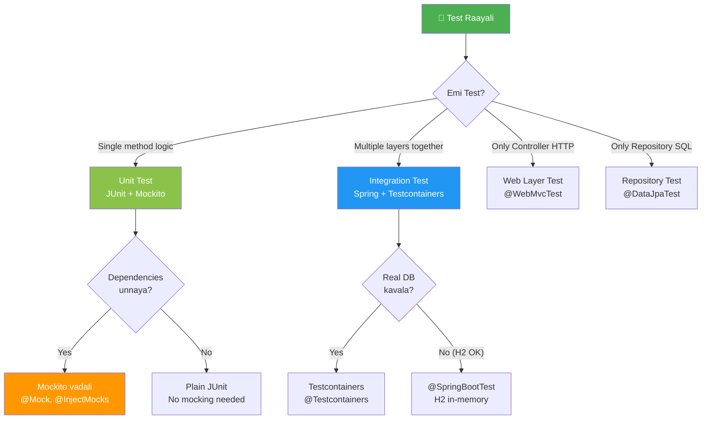

# 🧪 Java Testing Mastery - Complete Reference Guide

> **Mawa, ee oka guide chadivthe JUnit, Mockito, Spring Testing anni master avuthav!**
> **Brush-up to Advanced level - Enterprise Ready!**

---

## 🎯 Quick Navigation

```
╔══════════════════════════════════════════════════════════════════════════╗
║  "Emi test cheyyali?" - ani doubt vasthe ee guide choodu!              ║
╚══════════════════════════════════════════════════════════════════════════╝
```

| Topic | Description | Folder |
|-------|-------------|--------|
| 🟢 **JUnit 5** | Assertions, Lifecycle, Parameterized Tests | [junit5/](./junit5/) |
| 🔵 **Mockito** | Mocking, Stubbing, Verification | [mockito/](./mockito/) |
| 🟣 **Spring Testing** | @SpringBootTest, MockMvc, Testcontainers | [spring-testing/](./spring-testing/) |
| ❓ **FAQ** | Common doubts & clarifications | [faq/](./faq/) |

---

## 🤔 Decision Flowchart - "Edi Use Cheyyali?"



---

## 📚 Learning Path (Recommended Order)

### 🟢 Week 1: JUnit 5 Fundamentals
```
1. junit5/01-lifecycle.md      → @BeforeEach, @AfterAll
2. junit5/02-assertions.md     → assertEquals, assertTrue
3. junit5/03-exceptions.md     → assertThrows
```

### 🟢 Week 2: JUnit 5 Advanced
```
4. junit5/04-parameterized.md  → @ParameterizedTest
5. junit5/05-nested-tests.md   → @Nested, @RepeatedTest
6. junit5/06-conditional.md    → @EnabledOnOs, @Tag
```

### 🔵 Week 3: Mockito
```
7. mockito/01-why-mocking.md   → Why mock?
8. mockito/02-mock-basics.md   → @Mock, @InjectMocks
9. mockito/03-stubbing.md      → when/thenReturn
10. mockito/04-verification.md → verify()
```

### 🔵 Week 4: Mockito Advanced
```
11. mockito/05-argument-matchers.md → any(), eq()
12. mockito/06-spy-vs-mock.md       → @Spy
13. mockito/07-bdd-style.md         → given/when/then
```

### 🟣 Week 5: Spring Testing
```
14. spring-testing/01-annotations.md    → @SpringBootTest
15. spring-testing/02-mockmvc.md        → MockMvc
16. spring-testing/03-slice-tests.md    → @WebMvcTest, @DataJpaTest
17. spring-testing/04-testcontainers.md → Docker testing
```

---

## 🏃 Quick Commands

```powershell
# Run ALL tests
.\mvnw.cmd test

# Run specific test class
.\mvnw.cmd test -Dtest=UserServiceTest

# Run tests by tag
.\mvnw.cmd test -Dgroups="fast"

# Run with coverage report
.\mvnw.cmd test jacoco:report
```

---

## 📁 Project Test Structure

```
src/test/java/com/learning/
├── junit5/          ← JUnit 5 concept demos
│   ├── Part1_LifecycleAndBasicAssertionsTest.java
│   ├── Part2_ExceptionTestingTest.java
│   └── ... (10 files)
│
├── mockito/         ← Mockito concept demos
│   ├── Part1_MockBasicsTest.java
│   ├── Part2_StubbingTest.java
│   └── ... (9 files)
│
├── controller/      ← Web layer tests
├── service/         ← Service layer tests
├── repository/      ← Data layer tests
├── integration/     ← Full integration tests
└── performance/     ← Load tests
```

---

## 🎯 Annotation Quick Reference

| Layer | Annotation | Purpose |
|-------|------------|---------|
| **JUnit** | `@Test` | Mark test method |
| **JUnit** | `@BeforeEach` | Run before each test |
| **JUnit** | `@ParameterizedTest` | Run with multiple inputs |
| **Mockito** | `@Mock` | Create mock object |
| **Mockito** | `@InjectMocks` | Inject mocks into SUT |
| **Spring** | `@SpringBootTest` | Full context integration |
| **Spring** | `@WebMvcTest` | Controller slice test |
| **Spring** | `@DataJpaTest` | Repository slice test |
| **Spring** | `@MockBean` | Mock in Spring context |

---

## 😂 Testing Jokes to Remember!

```
🙈 "Unit test pass ayyindi but production lo fail?"
   → Integration test raayaledu bro!

🐛 "Bug fix chesanu, inka tests green?"
   → Bug gurinchi test raayaledu anthe!

🔥 "100% coverage but still bugs?"
   → Coverage != Correctness. Edge cases miss!
```

---

> **Happy Testing Mawa! 🚀**
> Any doubts? Check the [FAQ](./faq/)!
