# 🎭 Mockito Visual Guide - Tenglish Edition

> **Mocking Eppudu, Edi, Ela Use Cheyyalo - Complete Decision Guide!**

---

## 🤔 Why Mocking? - Core Problem


**Problem:** Real dependencies use chesthe tests slow, flaky, and external services kavali.
**Solution:** Fake objects (Mocks) create chesi, ONLY our logic test chestham!

---

## 📋 Master Decision Flowchart

```mermaid
flowchart TD
    START["🎭 Mockito Use\nCheyyali"] --> Q1{"Dependency\nType Enti?"}
    
    Q1 -->|"Interface/Class\n(Complete Fake)"| MOCK["@Mock"]
    Q1 -->|"Real Object +\nSome Fake Methods"| SPY["@Spy"]
    
    MOCK --> Q2{"Emi Cheyyali\nMock Tho?"}
    
    Q2 -->|"Return Value Set"| STUB["Stubbing\nwhen().thenReturn()"]
    Q2 -->|"Method Call Verify"| VERIFY["Verification\nverify()"]
    Q2 -->|"Passed Arguments Capture"| CAPTOR["@Captor\nArgumentCaptor"]
    
    STUB --> S1{"Return Type?"}
    S1 -->|"Simple Value"| TR["when(mock.method())\n.thenReturn(value)"]
    S1 -->|"Exception"| TTH["when(mock.method())\n.thenThrow(exception)"]
    S1 -->|"Dynamic/Conditional"| TA["when(mock.method())\n.thenAnswer(invocation -> ...)"]
    S1 -->|"Multiple Calls"| TM["when(mock.method())\n.thenReturn(first)\n.thenReturn(second)"]
    
    VERIFY --> V1{"Ennisarlu\nCall Ayyindi?"}
    V1 -->|"Exactly Once"| V1T["verify(mock).method()"]
    V1 -->|"N Times"| V1N["verify(mock, times(n)).method()"]
    V1 -->|"Never"| V1NE["verify(mock, never()).method()"]
    V1 -->|"At Least/Most"| V1AM["verify(mock, atLeast(n))\nverify(mock, atMost(n))"]
    
    SPY --> SP1["Real methods run\nEXCEPT stubbed ones"]
    
    style START fill:#9C27B0,color:white
    style MOCK fill:#2196F3,color:white
    style SPY fill:#FF9800,color:white
    style STUB fill:#4CAF50,color:white
    style VERIFY fill:#E91E63,color:white
    style CAPTOR fill:#00BCD4,color:white
```



---

## 🔧 Core Annotations

### @Mock vs @Spy vs @InjectMocks

```mermaid
flowchart TB
    subgraph ANNOTATIONS["Mockito Annotations"]
        MOCK["@Mock\n─────────────\n• Complete Fake Object\n• All methods return defaults\n• No real code runs"]
        
        SPY["@Spy\n─────────────\n• Real Object + Override\n• Real methods run by default\n• Can stub specific methods"]
        
        INJECT["@InjectMocks\n─────────────\n• Class Under Test\n• Mocks auto-inject\n• Constructor/Setter injection"]
    end
    
    MOCK -->|"Injected into"| INJECT
    SPY -->|"Injected into"| INJECT
    
    style MOCK fill:#2196F3,color:white
    style SPY fill:#FF9800,color:white
    style INJECT fill:#4CAF50,color:white
```



**Setup Required:**
```java
@ExtendWith(MockitoExtension.class)  // JUnit 5
class UserServiceTest {
    
    @Mock
    private UserRepository userRepository;  // Complete fake
    
    @Mock
    private EmailService emailService;      // Complete fake
    
    @Spy
    private AuditLogger auditLogger = new AuditLogger();  // Real + overrides
    
    @InjectMocks
    private UserService userService;  // Class we're testing (gets mocks injected)
}
```

---

## 📌 Stubbing - when/thenReturn Patterns

### Decision: Edi Use Cheyyali?


### Code Examples:

```java
// ✅ thenReturn - Simple value return
when(userRepository.findById(1L))
    .thenReturn(Optional.of(user));

// ✅ thenThrow - Exception simulate
when(userRepository.findById(999L))
    .thenThrow(new EntityNotFoundException("User not found"));

// ✅ Multiple calls - Different returns each call
when(tokenService.generateToken())
    .thenReturn("token1")      // First call
    .thenReturn("token2")      // Second call
    .thenReturn("token3");     // Third call onwards

// ✅ thenAnswer - Dynamic response based on input
when(userRepository.save(any(User.class)))
    .thenAnswer(invocation -> {
        User userArg = invocation.getArgument(0);
        userArg.setId(100L);  // Simulate DB assigning ID
        return userArg;
    });

// ✅ void methods - Use doXxx()
doNothing().when(emailService).sendEmail(any());
doThrow(new MailException("SMTP down"))
    .when(emailService).sendEmail(eq("invalid@test.com"));
```

---

## 🔍 Argument Matchers

### When to Use Which?


### ⚠️ Golden Rule:

```java
// ❌ WRONG: Mixing matchers with real values
when(service.process(any(), "fixed"))  // ERROR!

// ✅ CORRECT: All matchers OR all real values
when(service.process(any(), eq("fixed")))  // OK!
when(service.process(user, "fixed"))       // OK! (all real)
```

### Common Matchers:

```java
// Type-based
any()                    // Any object
any(User.class)          // Any User object
anyString()              // Any string (not null)
anyInt(), anyLong()      // Any primitive
anyList(), anyMap()      // Any collection

// Null handling
any()                    // Matches anything INCLUDING null
any(User.class)          // Does NOT match null
nullable(User.class)     // Matches User OR null
isNull()                 // Only null
isNotNull()              // Not null

// Custom conditions
argThat(user -> user.getName().startsWith("A"))
argThat(list -> list.size() > 5)

// String matchers
contains("substring")
startsWith("prefix")
endsWith("suffix")
matches("regex.*")
```

---

## ✔️ Verification Patterns

### How Many Times Called?


### Verification Examples:

```java
// Basic - was method called?
verify(emailService).sendEmail("user@test.com");

// Exact count
verify(repository, times(3)).save(any());

// Never called
verify(emailService, never()).sendEmail("admin@test.com");

// At least/most
verify(logger, atLeastOnce()).log(any());
verify(api, atMost(5)).call(any());

// Order verification
InOrder inOrder = inOrder(userRepository, emailService);
inOrder.verify(userRepository).save(any());
inOrder.verify(emailService).sendEmail(any());

// No more interactions
verifyNoMoreInteractions(emailService);
verifyNoInteractions(auditLogger);  // Never touched at all
```

---

## 📸 Argument Captor

### When Passed Arguments Capture Cheyyali?


### Code Example:

```java
@Captor
ArgumentCaptor<User> userCaptor;

@Test
void shouldSetCorrectFieldsBeforeSaving() {
    // When
    userService.registerUser("John", "john@test.com", "password");
    
    // Capture what was passed to save()
    verify(userRepository).save(userCaptor.capture());
    
    // Assert on captured object
    User capturedUser = userCaptor.getValue();
    assertEquals("John", capturedUser.getName());
    assertEquals("john@test.com", capturedUser.getEmail());
    assertTrue(capturedUser.getCreatedAt() != null);
    
    // Multiple captures
    verify(emailService, times(2)).sendEmail(stringCaptor.capture());
    List<String> allEmails = stringCaptor.getAllValues();
    assertEquals(2, allEmails.size());
}
```

---

## 🎭 BDD Style (given/when/then)


```java
import static org.mockito.BDDMockito.*;

@Test
void shouldRegisterUser_BDDStyle() {
    // Given (Arrange)
    given(userRepository.existsByEmail("test@email.com"))
        .willReturn(false);
    given(userRepository.save(any(User.class)))
        .willAnswer(inv -> {
            User u = inv.getArgument(0);
            u.setId(1L);
            return u;
        });
    
    // When (Act)
    User result = userService.registerUser("Test", "test@email.com", "pass123");
    
    // Then (Assert)
    assertNotNull(result.getId());
    then(userRepository).should().save(any(User.class));
    then(emailService).should().sendWelcomeEmail(eq("test@email.com"));
}
```

---

## 🏢 Enterprise Scenarios

### Advanced Patterns Quick Reference


```java
// Static method mocking
try (MockedStatic<UUID> mockedUUID = mockStatic(UUID.class)) {
    UUID fixedId = UUID.fromString("123e4567-e89b-12d3-a456-426614174000");
    mockedUUID.when(UUID::randomUUID).thenReturn(fixedId);
    
    // Inside this block, UUID.randomUUID() returns fixedId
    assertEquals(fixedId, UUID.randomUUID());
}
// Outside block, original behavior restored

// Deep stubs for chained calls
@Mock(answer = Answers.RETURNS_DEEP_STUBS)
HttpServletRequest request;

when(request.getSession().getAttribute("user"))
    .thenReturn(mockUser);  // No NPE on getSession()!

// Lenient stubbing (won't fail for unused stubs)
lenient().when(userRepository.findById(anyLong()))
    .thenReturn(Optional.of(user));

// Timeout verification (async scenarios)
verify(eventPublisher, timeout(1000)).publish(any());
```

---

## 🎯 Quick Memory Tips

```
SETUP:
@ExtendWith(MockitoExtension.class)  → Enable Mockito
@Mock           → Complete fake object
@Spy            → Real object with overrides
@InjectMocks    → Class under test (receives mocks)
@Captor         → Capture passed arguments

STUBBING:
when().thenReturn()   → Return specific value
when().thenThrow()    → Throw exception
when().thenAnswer()   → Dynamic response
doNothing/doThrow()   → For void methods

MATCHERS:
any()                 → Any value (including null)
eq(value)             → Exact value
argThat(predicate)    → Custom condition

VERIFICATION:
verify(mock).method()         → Was called?
verify(mock, times(n))        → Called n times?
verify(mock, never())         → Never called?
verifyNoMoreInteractions()    → Nothing else called?

BDD STYLE:
given().willReturn()  → instead of when().thenReturn()
then().should()       → instead of verify()
```

---

## 🚀 Complete Real-World Example

```java
@ExtendWith(MockitoExtension.class)
class UserServiceTest {
    
    @Mock private UserRepository userRepository;
    @Mock private EmailService emailService;
    @Mock private PasswordEncoder passwordEncoder;
    @Captor private ArgumentCaptor<User> userCaptor;
    
    @InjectMocks
    private UserService userService;
    
    @Test
    @DisplayName("Should register new user successfully")
    void shouldRegisterNewUser() {
        // Given
        given(userRepository.existsByEmail("new@test.com")).willReturn(false);
        given(passwordEncoder.encode("rawPass")).willReturn("encodedPass");
        given(userRepository.save(any(User.class))).willAnswer(inv -> {
            User u = inv.getArgument(0);
            u.setId(1L);
            return u;
        });
        
        // When
        User result = userService.registerUser("John", "new@test.com", "rawPass");
        
        // Then
        assertNotNull(result.getId());
        
        // Verify password was encoded
        then(passwordEncoder).should().encode("rawPass");
        
        // Verify correct user was saved
        then(userRepository).should().save(userCaptor.capture());
        User savedUser = userCaptor.getValue();
        assertEquals("John", savedUser.getName());
        assertEquals("encodedPass", savedUser.getPassword());  // Encoded!
        
        // Verify welcome email sent
        then(emailService).should().sendWelcomeEmail("new@test.com");
    }
    
    @Test
    @DisplayName("Should reject duplicate email")
    void shouldRejectDuplicateEmail() {
        // Given
        given(userRepository.existsByEmail("exists@test.com")).willReturn(true);
        
        // When & Then
        assertThrows(IllegalStateException.class, () ->
            userService.registerUser("Jane", "exists@test.com", "pass123"));
        
        // Verify nothing was saved or emailed
        then(userRepository).should(never()).save(any());
        then(emailService).shouldHaveNoInteractions();
    }
}
```
