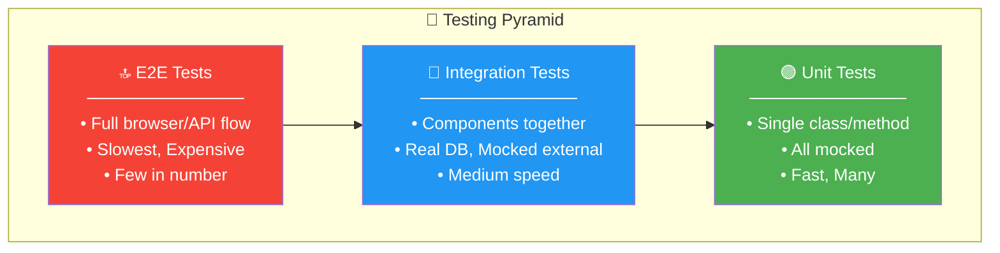
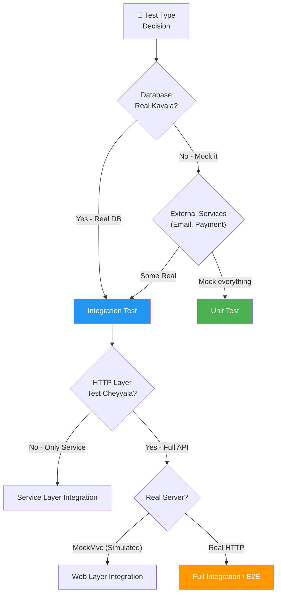
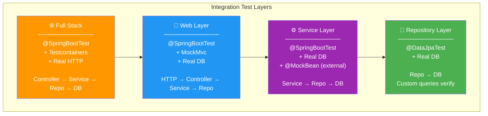
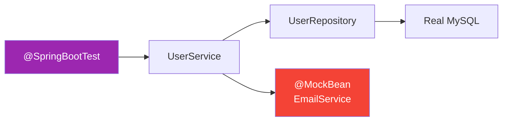
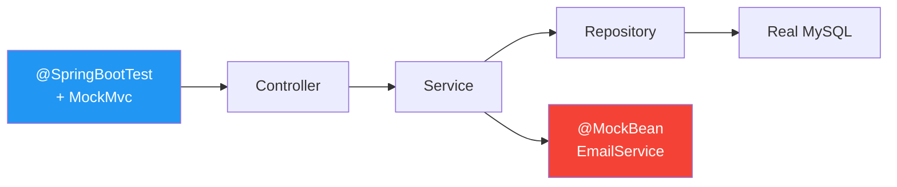
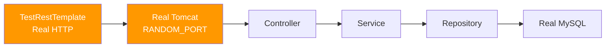
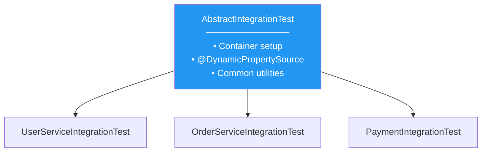
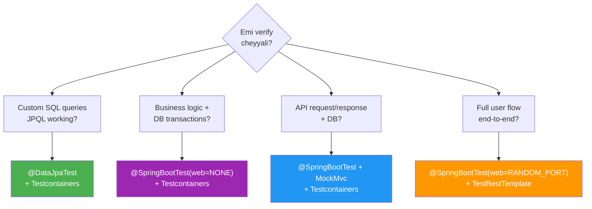
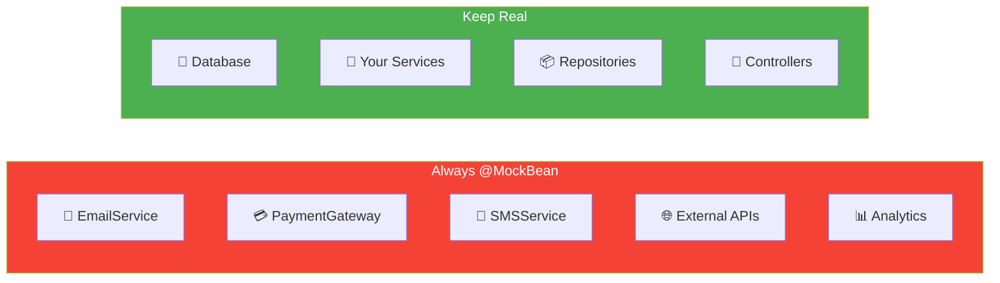

# 🔗 Integration Testing Visual Guide - Tenglish Edition

> **Unit Test vs Integration Test vs E2E Test - Clarity Time!**

---

## 🎯 Testing Pyramid - Big Picture

```mermaid
pyramid
    title Testing Pyramid
    "E2E Tests" : 10
    "Integration Tests" : 30  
    "Unit Tests" : 60
```



---

## 🤔 Unit Test vs Integration Test - Decision Matrix



### Quick Comparison Table:

| Aspect | Unit Test | Integration Test | E2E Test |
|--------|-----------|------------------|----------|
| **Scope** | Single class | Multiple components | Whole system |
| **Database** | Mocked | Real (H2/Testcontainers) | Real |
| **External APIs** | Mocked | Mocked | Real or Mocked |
| **Speed** | ⚡ Milliseconds | 🔄 Seconds | 🐢 Minutes |
| **Quantity** | Many (100s) | Medium (10s) | Few (5-10) |
| **Purpose** | Logic correct? | Components work together? | User flow works? |

---

## 🏗️ Integration Test Layers

### What Can You Integration Test?



---

## 🔷 Layer-Wise Testing Guide

### 1️⃣ Repository Layer Integration

**Purpose:** Custom queries, JPQL, relationships working?


```java
@DataJpaTest
@AutoConfigureTestDatabase(replace = Replace.NONE)
@Testcontainers
class UserRepositoryIntegrationTest {
    
    @Container
    static MySQLContainer<?> mysql = new MySQLContainer<>("mysql:8.0");
    
    @DynamicPropertySource
    static void configureDatabase(DynamicPropertyRegistry registry) {
        registry.add("spring.datasource.url", mysql::getJdbcUrl);
        registry.add("spring.datasource.username", mysql::getUsername);
        registry.add("spring.datasource.password", mysql::getPassword);
    }
    
    @Autowired
    private UserRepository userRepository;
    
    @Test
    void shouldFindActiveUsersWithCustomQuery() {
        // Given - data setup
        userRepository.save(new User("Active", "a@test.com", true));
        userRepository.save(new User("Inactive", "i@test.com", false));
        
        // When - custom query
        List<User> activeUsers = userRepository.findAllActiveUsers();
        
        // Then
        assertEquals(1, activeUsers.size());
        assertEquals("Active", activeUsers.get(0).getName());
    }
}
```

---

### 2️⃣ Service Layer Integration

**Purpose:** Business logic + Real DB, but no HTTP layer



```java
@SpringBootTest(webEnvironment = WebEnvironment.NONE)  // No web!
@Testcontainers
class UserServiceIntegrationTest {
    
    @Container
    static MySQLContainer<?> mysql = new MySQLContainer<>("mysql:8.0");
    
    // ... DynamicPropertySource ...
    
    @Autowired
    private UserService userService;  // Real service
    
    @Autowired
    private UserRepository userRepository;  // Real repo
    
    @MockBean
    private EmailService emailService;  // Mock external!
    
    @Test
    void shouldRegisterAndSaveToDatabase() {
        // When - call service directly (no HTTP)
        User result = userService.registerUser("John", "john@test.com", "pass123");
        
        // Then - verify in real DB
        assertNotNull(result.getId());
        assertTrue(userRepository.existsByEmail("john@test.com"));
        
        // Verify email mock was called
        verify(emailService).sendWelcomeEmail("john@test.com");
    }
}
```

---

### 3️⃣ Web Layer Integration

**Purpose:** Full API flow with MockMvc + Real DB



```java
@SpringBootTest  // webEnvironment = MOCK (default)
@AutoConfigureMockMvc
@Testcontainers
class UserControllerIntegrationTest {
    
    @Container
    static MySQLContainer<?> mysql = new MySQLContainer<>("mysql:8.0");
    
    // ... DynamicPropertySource ...
    
    @Autowired
    private MockMvc mockMvc;  // Simulated HTTP
    
    @Autowired
    private UserRepository userRepository;
    
    @MockBean
    private EmailService emailService;
    
    @Test
    void shouldCreateUserViaAPI() throws Exception {
        // When - HTTP request via MockMvc
        mockMvc.perform(post("/api/users")
                .contentType(APPLICATION_JSON)
                .content("""
                    {"name": "John", "email": "john@test.com", "password": "pass123"}
                    """))
            .andExpect(status().isCreated())
            .andExpect(jsonPath("$.id").exists())
            .andExpect(jsonPath("$.name").value("John"));
        
        // Then - verify persisted in real DB
        assertTrue(userRepository.existsByEmail("john@test.com"));
    }
}
```

---

### 4️⃣ Full Stack Integration (E2E-like)

**Purpose:** Real HTTP + Real DB + Real Server



```java
@SpringBootTest(webEnvironment = WebEnvironment.RANDOM_PORT)  // Real server!
@Testcontainers
class FullIntegrationTest {
    
    @Container
    static MySQLContainer<?> mysql = new MySQLContainer<>("mysql:8.0");
    
    // ... DynamicPropertySource ...
    
    @Autowired
    private TestRestTemplate restTemplate;  // Real HTTP client
    
    @LocalServerPort
    private int port;  // Actual port
    
    @MockBean
    private EmailService emailService;  // Still mock external
    
    @Test
    void shouldCompleteFullUserFlow() {
        // Create user - Real HTTP call
        var createRequest = new UserRequest("John", "john@test.com", "pass123");
        ResponseEntity<User> createResponse = restTemplate.postForEntity(
            "/api/users", createRequest, User.class);
        
        assertEquals(HttpStatus.CREATED, createResponse.getStatusCode());
        Long userId = createResponse.getBody().getId();
        
        // Get user - Real HTTP call
        ResponseEntity<User> getResponse = restTemplate.getForEntity(
            "/api/users/" + userId, User.class);
        
        assertEquals(HttpStatus.OK, getResponse.getStatusCode());
        assertEquals("John", getResponse.getBody().getName());
    }
}
```

---

## 🐳 Testcontainers Best Practices

### Reusable Base Test Class



```java
@SpringBootTest(webEnvironment = WebEnvironment.RANDOM_PORT)
@Testcontainers
public abstract class AbstractIntegrationTest {
    
    @Container
    protected static MySQLContainer<?> mysql = new MySQLContainer<>("mysql:8.0")
        .withDatabaseName("testdb")
        .withUsername("test")
        .withPassword("test")
        .withReuse(true);  // Reuse container across tests!
    
    @DynamicPropertySource
    static void configureDatabase(DynamicPropertyRegistry registry) {
        registry.add("spring.datasource.url", mysql::getJdbcUrl);
        registry.add("spring.datasource.username", mysql::getUsername);
        registry.add("spring.datasource.password", mysql::getPassword);
        registry.add("spring.jpa.hibernate.ddl-auto", () -> "create-drop");
    }
    
    @Autowired
    protected TestRestTemplate restTemplate;
    
    // Helper methods
    protected void cleanDatabase() {
        // Cleanup logic
    }
}
```

### Container Reuse (Faster Tests!)

```properties
# ~/.testcontainers.properties
testcontainers.reuse.enable=true
```

```java
@Container
static MySQLContainer<?> mysql = new MySQLContainer<>("mysql:8.0")
    .withReuse(true);  // Don't stop after test class!
```

---

## 🎯 Decision Guide - Which Integration Layer?



| Question | Answer | Use |
|----------|--------|-----|
| Repository queries correct? | @DataJpaTest | Only JPA layer |
| Service + DB together? | @SpringBootTest(NONE) | No web, just service |
| API + DB together? | @SpringBootTest + MockMvc | Simulated HTTP |
| Full real HTTP flow? | @SpringBootTest(RANDOM_PORT) | Real server |

---

## 🚫 What to Always Mock in Integration Tests



**Rule:** External systems mock cheyyali, Internal components real ga test cheyyali!

---

## 📋 Integration Test Checklist

```
PRE-TEST:
━━━━━━━━━━━━━━━━━━━━━━━━━━━━━━━━━━━━━━━━
□ Testcontainers dependency added?
□ Docker running?
□ @Testcontainers annotation added?
□ @Container for DB container?
□ @DynamicPropertySource configured?

DATABASE:
━━━━━━━━━━━━━━━━━━━━━━━━━━━━━━━━━━━━━━━━
□ Each test independent? (clean data)
□ @BeforeEach cleanup or @Transactional?
□ Test data setup correct?

EXTERNAL SERVICES:
━━━━━━━━━━━━━━━━━━━━━━━━━━━━━━━━━━━━━━━━
□ EmailService mocked?
□ PaymentGateway mocked?
□ All external APIs mocked?

ASSERTIONS:
━━━━━━━━━━━━━━━━━━━━━━━━━━━━━━━━━━━━━━━━
□ Response verified?
□ Database state verified?
□ Mock interactions verified?
```

---

## 🚀 Complete Integration Test Example

```java
@SpringBootTest(webEnvironment = WebEnvironment.RANDOM_PORT)
@Testcontainers
@TestMethodOrder(OrderAnnotation.class)
class UserFlowIntegrationTest extends AbstractIntegrationTest {
    
    @Autowired private TestRestTemplate restTemplate;
    @Autowired private UserRepository userRepository;
    
    @MockBean private EmailService emailService;
    @MockBean private PaymentGateway paymentGateway;
    
    private static Long createdUserId;
    
    @BeforeEach
    void setup() {
        userRepository.deleteAll();
    }
    
    @Test
    @Order(1)
    @DisplayName("1️⃣ Should register new user")
    void shouldRegisterUser() {
        // Given
        var request = new UserRequest("John", "john@test.com", "secure123");
        
        // When
        ResponseEntity<User> response = restTemplate.postForEntity(
            "/api/users", request, User.class);
        
        // Then - HTTP Response
        assertEquals(HttpStatus.CREATED, response.getStatusCode());
        assertNotNull(response.getBody().getId());
        createdUserId = response.getBody().getId();
        
        // Then - Database
        User inDb = userRepository.findById(createdUserId).orElseThrow();
        assertEquals("John", inDb.getName());
        
        // Then - Email sent
        verify(emailService).sendWelcomeEmail("john@test.com");
    }
    
    @Test
    @Order(2)
    @DisplayName("2️⃣ Should retrieve registered user")
    void shouldGetUser() {
        // First create a user
        userRepository.save(new User("Jane", "jane@test.com", "pass123"));
        
        // When
        ResponseEntity<User> response = restTemplate.getForEntity(
            "/api/users/email/jane@test.com", User.class);
        
        // Then
        assertEquals(HttpStatus.OK, response.getStatusCode());
        assertEquals("Jane", response.getBody().getName());
    }
    
    @Test
    @Order(3)
    @DisplayName("3️⃣ Should reject duplicate email")
    void shouldRejectDuplicateEmail() {
        // Given - user exists
        userRepository.save(new User("Existing", "exists@test.com", "pass123"));
        
        // When - try to create with same email
        var request = new UserRequest("New", "exists@test.com", "pass456");
        ResponseEntity<ErrorResponse> response = restTemplate.postForEntity(
            "/api/users", request, ErrorResponse.class);
        
        // Then
        assertEquals(HttpStatus.CONFLICT, response.getStatusCode());
        assertTrue(response.getBody().getMessage().contains("already exists"));
        
        // Then - no email sent
        verify(emailService, never()).sendWelcomeEmail(any());
    }
}
```

---

## 🎯 Quick Memory Tips

```
INTEGRATION TEST LAYERS:
━━━━━━━━━━━━━━━━━━━━━━━━━━━━━━━━━━━━━━━━
Repository only    → @DataJpaTest
Service + DB       → @SpringBootTest(NONE)
Controller + DB    → @SpringBootTest + MockMvc
Full HTTP + DB     → @SpringBootTest(RANDOM_PORT)

ALWAYS MOCK:
━━━━━━━━━━━━━━━━━━━━━━━━━━━━━━━━━━━━━━━━
Email, SMS, Payment, External APIs

ALWAYS REAL:
━━━━━━━━━━━━━━━━━━━━━━━━━━━━━━━━━━━━━━━━
Database (via Testcontainers)
Your Services, Repos, Controllers

TESTCONTAINERS:
━━━━━━━━━━━━━━━━━━━━━━━━━━━━━━━━━━━━━━━━
@Testcontainers     → Enable
@Container          → Declare container
@DynamicPropertySource → Configure Spring
.withReuse(true)    → Faster tests!
```
