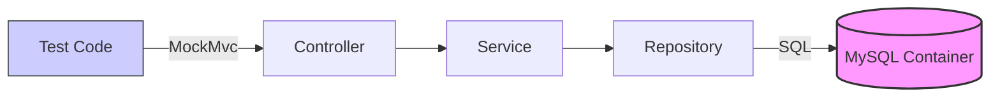
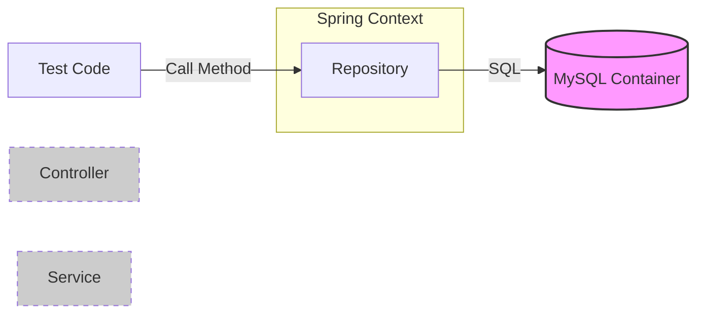

# 🧪 Spring Boot Integration Testing - The Masterclass

Mawa, **Integration Testing** ante pedda confused concept. Deenini simple ga 4 types ga divide cheddam.

Prathi Type ki:
1.  **Ye Annotations vadali?** 📝
2.  **Yela panichestundi?** (Mermaid Diagram) 📊
3.  **Real Code ekkada undi?** 💻

---

## 1. 🌍 Full Stack Integration Test (End-to-End)

Idhi "Real World" test. Postman nundi request pampinchatlu untundi.

**Target:** `Controller` -> `Service` -> `Repository` -> `Database (Docker)`

### 📝 Key Annotations

| Annotation | Why? (Enduku?) |
| :--- | :--- |
| **`@SpringBootTest`** | Application mottam start chestundi (Beans, Configurations anni). |
| **`@AutoConfigureMockMvc`** | `MockMvc` ni create chestundi (HTTP Requests fake cheyyadaniki). |
| **`@Testcontainers`** | Docker containers ni manage chestundi (Start/Stop). |
| **`@Container`** | "Ee variable oka Docker Container" ani cheptundi. |
| **`@DynamicPropertySource`** | Docker IP/Port ni Spring Boot properties ki connect chestundi. |

### 📊 Diagram


> **Code:** [UserControllerIntegrationTest.java](file:///d:/Antigravity_Projects/Junit_Mockito_MockMVC/src/test/java/com/learning/integration/UserControllerIntegrationTest.java)

---

## 2. ✂️ Repository Slice Test (Data Layer)

Only Database queries complex ga unnapudu idi vadali.

**Target:** `Repository` -> `Database (Docker)` (NO Controller, NO Service)

### 📝 Key Annotations

| Annotation | Why? (Enduku?) |
| :--- | :--- |
| **`@DataJpaTest`** | Only Repository related beans ye load avthayi. Very Fast! ⚡ |
| **`@AutoConfigureTestDatabase`** | Default ga Spring H2 (In-Memory) vadutundi. Manam REAL DB vadali kabatti `replace=NONE` ani pedtam. |

### 📊 Diagram


> **Code:** [UserRepositoryTest.java](file:///d:/Antigravity_Projects/Junit_Mockito_MockMVC/src/test/java/com/learning/repository/UserRepositoryTest.java)

---

## 3. ⚙️ Service Slice Test (Business Logic)

Controller vaddu, DB kavali. Complex logic (Math, Validations) unnapudu idi better.

**Target:** `Service` -> `Repository` -> `Database (Docker)`

### 📝 Key Annotations

| Annotation | Why? (Enduku?) |
| :--- | :--- |
| **`@SpringBootTest`** | Full Context load avtundi. |
| **`@MockBean`** | External dependencies (Email/Kafka) ni Mock cheyyadaniki. |

### 📊 Diagram
```mermaid
graph LR
    Test[Test Code] -- Call Method --> Service
    Service --> Repo[Repository]
    Repo -- SQL --> DB[(MySQL Container)]
    Service -.-> Email[Email Service (MOCKED)]
    style Email fill:#eee,stroke:#333,stroke-dasharray: 5 5
```

> **Code:** [UserServiceIntegrationTest.java](file:///d:/Antigravity_Projects/Junit_Mockito_MockMVC/src/test/java/com/learning/integration/UserServiceIntegrationTest.java)

---

## 4. 🕸️ Web Layer Slice Test (Controller Only)

Only URL urls, HTTP Status codes, Request Body parsing test cheyyadaniki.
**Database asalu touch avvadu!**

**Target:** `Controller` -> `Service (MOCKED)`

### 📝 Key Annotations

| Annotation | Why? (Enduku?) |
| :--- | :--- |
| **`@WebMvcTest`** | Only Controller beans ye load avthayi. Service/Repo load avvavu. |
| **`@MockBean`** | `UserService` ni mock chestam. DB avasaram ledu. |

### 📊 Diagram
```mermaid
graph LR
    Test[Test Code] -- MockMvc --> Controller
    Controller -.-> Service[Service (MOCKED)]
    style Service fill:#eee,stroke:#333,stroke-dasharray: 5 5
    style DB fill:#ccc,stroke:#333,stroke-dasharray: 5 5
```

> **Code:** [UserControllerWebLayerTest.java](file:///d:/Antigravity_Projects/Junit_Mockito_MockMVC/src/test/java/com/learning/controller/UserControllerWebLayerTest.java)

---

## 🚀 Summary Cheatsheet

| Test Type | Speed | Uses Real DB? | Annotations |
| :--- | :--- | :--- | :--- |
| **Full Stack** | 🐢 Slow | ✅ Yes | `@SpringBootTest`, `@AutoConfigureMockMvc` |
| **Repository** | ⚡ Fast | ✅ Yes | `@DataJpaTest` |
| **Service** | 🐇 Medium | ✅ Yes | `@SpringBootTest` |
| **Web Layer** | ⚡ Fast | ❌ No | `@WebMvcTest` |
