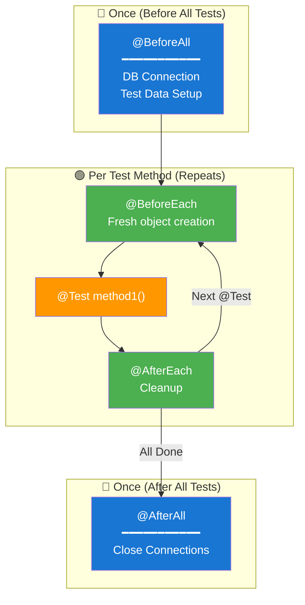

# 🔄 JUnit 5 Lifecycle Annotations

> **Mawa, test execution order ela untundo ee file lo clear ga explain chesanu!**

---

## 🤔 What is Lifecycle?

Test lifecycle ante - **test execution process lo different stages ki different methods run avvadam**.

```
Real Life Analogy:
🍳 Cooking = Test

@BeforeAll  = Kitchen open cheyadam (once)
@BeforeEach = Ingredients ready cheyadam (every dish ki)
@Test       = Actual cooking
@AfterEach  = Plates wash (every dish tarvata)
@AfterAll   = Kitchen close (once)
```

---

## 📋 Annotations Complete Reference

| Annotation | When Runs | Must be Static? | Use Case |
|------------|-----------|-----------------|----------|
| `@BeforeAll` | Once before ALL tests | ✅ Yes | DB connection, heavy setup |
| `@BeforeEach` | Before EACH test | ❌ No | Fresh object creation |
| `@Test` | Actual test method | ❌ No | Test logic |
| `@AfterEach` | After EACH test | ❌ No | Cleanup per test |
| `@AfterAll` | Once after ALL tests | ✅ Yes | Close connections |

---

## 📊 Execution Order Diagram



---

## 💻 Code Example

```java
class LifecycleDemo {
    
    private Calculator calc;
    
    // ━━━━━━━━━━━━━━━━━━━━━━━━━━━━━━━━━━━━━━━━━━━━━━━━━
    // 1️⃣ @BeforeAll - Runs ONCE before all tests
    // ━━━━━━━━━━━━━━━━━━━━━━━━━━━━━━━━━━━━━━━━━━━━━━━━━
    @BeforeAll
    static void setupOnce() {  // Must be STATIC!
        System.out.println("🚀 Test Suite Starting...");
        // Heavy operations here:
        // - Database connection
        // - Load test data from file
        // - Setup external resources
    }
    
    // ━━━━━━━━━━━━━━━━━━━━━━━━━━━━━━━━━━━━━━━━━━━━━━━━━
    // 2️⃣ @BeforeEach - Runs before EVERY test
    // ━━━━━━━━━━━━━━━━━━━━━━━━━━━━━━━━━━━━━━━━━━━━━━━━━
    @BeforeEach
    void setupEach() {
        calc = new Calculator();  // Fresh instance!
        System.out.println("📦 Fresh Calculator created");
    }
    
    // ━━━━━━━━━━━━━━━━━━━━━━━━━━━━━━━━━━━━━━━━━━━━━━━━━
    // 3️⃣ @Test - Actual test methods
    // ━━━━━━━━━━━━━━━━━━━━━━━━━━━━━━━━━━━━━━━━━━━━━━━━━
    @Test
    void testAdd() {
        assertEquals(4, calc.add(2, 2));
    }
    
    @Test
    void testSubtract() {
        assertEquals(0, calc.subtract(2, 2));
    }
    
    // ━━━━━━━━━━━━━━━━━━━━━━━━━━━━━━━━━━━━━━━━━━━━━━━━━
    // 4️⃣ @AfterEach - Runs after EVERY test
    // ━━━━━━━━━━━━━━━━━━━━━━━━━━━━━━━━━━━━━━━━━━━━━━━━━
    @AfterEach
    void cleanupEach() {
        calc = null;  // Cleanup
        System.out.println("🧹 Cleanup done");
    }
    
    // ━━━━━━━━━━━━━━━━━━━━━━━━━━━━━━━━━━━━━━━━━━━━━━━━━
    // 5️⃣ @AfterAll - Runs ONCE after all tests
    // ━━━━━━━━━━━━━━━━━━━━━━━━━━━━━━━━━━━━━━━━━━━━━━━━━
    @AfterAll
    static void teardownOnce() {  // Must be STATIC!
        System.out.println("🏁 Test Suite Complete!");
        // Close connections here
    }
}
```

**Console Output:**
```
🚀 Test Suite Starting...       ← @BeforeAll (once)
📦 Fresh Calculator created     ← @BeforeEach
✓ testAdd                       ← @Test
🧹 Cleanup done                 ← @AfterEach
📦 Fresh Calculator created     ← @BeforeEach
✓ testSubtract                  ← @Test
🧹 Cleanup done                 ← @AfterEach
🏁 Test Suite Complete!         ← @AfterAll (once)
```

---

## 🎯 When to Use What?

| Scenario | Annotation | Example |
|----------|------------|---------|
| DB connection open cheyyali | `@BeforeAll` | Connection pool setup |
| Each test ki fresh object kavali | `@BeforeEach` | `new Service()` |
| File handles close cheyyali | `@AfterEach` | `stream.close()` |
| DB connection close cheyyali | `@AfterAll` | Connection pool shutdown |

---

## ⚠️ Common Mistakes

### ❌ Mistake 1: @BeforeAll not static
```java
@BeforeAll
void setup() { }  // ❌ ERROR! Must be static
```

### ✅ Correct:
```java
@BeforeAll
static void setup() { }  // ✅ Correct
```

### ❌ Mistake 2: Sharing mutable state
```java
class BadTest {
    private int counter = 0;  // Shared across tests!
    
    @Test void test1() { counter++; }  // counter = 1
    @Test void test2() { counter++; }  // counter = 2?? Unpredictable!
}
```

### ✅ Correct:
```java
class GoodTest {
    private int counter;
    
    @BeforeEach
    void reset() { counter = 0; }  // Fresh each time!
    
    @Test void test1() { counter++; }  // counter = 1
    @Test void test2() { counter++; }  // counter = 1 (reset!)
}
```

---

## 🏢 Enterprise Pattern

```java
@TestInstance(Lifecycle.PER_CLASS)  // One instance for all tests
class ExpensiveResourceTest {
    
    private ExpensiveService service;  // Costly to create
    
    @BeforeAll
    void setup() {  // No need for static now!
        service = new ExpensiveService();  // Create once
    }
    
    @Test void test1() { /* use service */ }
    @Test void test2() { /* use service */ }
    
    @AfterAll
    void teardown() {
        service.close();  // Cleanup once
    }
}
```

---

## 😂 Memory Trick

```
BeforeAll = Band kaadniku setup (oka sari)
BeforeEach = Audience ki pani (every test ki)
Test = Performance!
AfterEach = Stage clean (every show tarvata)
AfterAll = Pack up and go home (end lo)
```

---

## 🔗 Related Topics

- [Assertions](./02-assertions.md) - Assert methods
- [Nested Tests](./05-nested-tests.md) - @BeforeEach in nested classes
- [Your Code](file:///d:/Antigravity_Projects/Junit_Mockito_MockMVC/src/test/java/com/learning/junit5/Part1_LifecycleAndBasicAssertionsTest.java) - See it in action!
