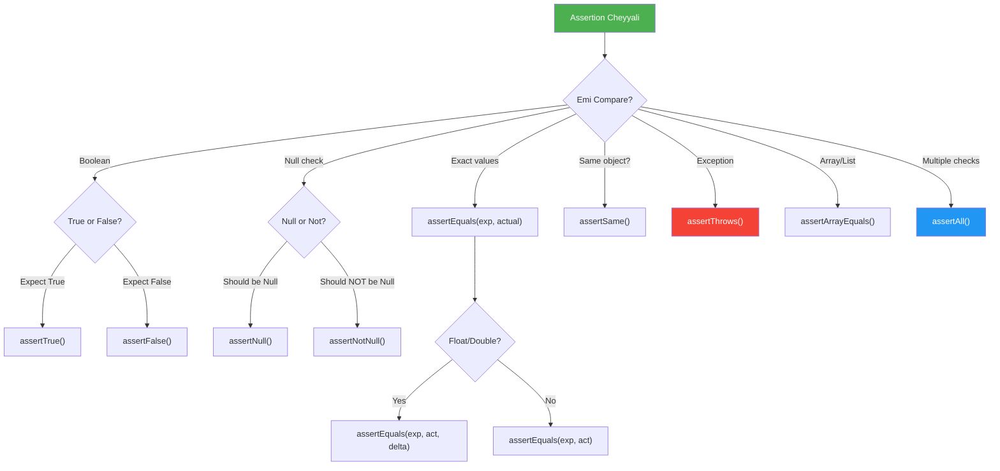
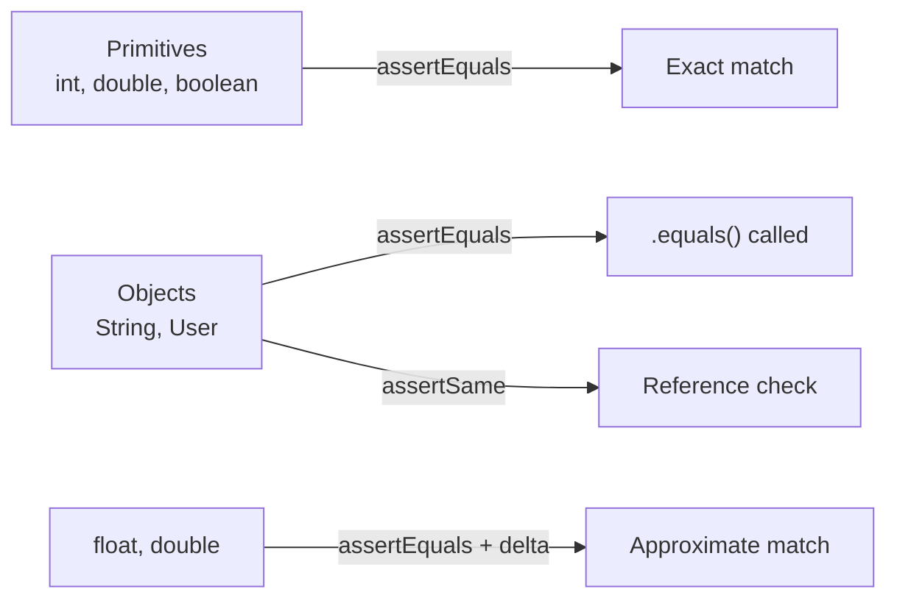

# ✅ JUnit 5 Assertions

> **Mawa, assertions ante test pass/fail decide cheyyali - anni types ikkada unnay!**

---

## 🤔 What are Assertions?

Assertions = **Expected result vs Actual result compare cheyadam**

```
Real Life:
🎯 You expect: 2 + 2 = 4
📊 Calculator gives: 4
✅ Match! Test PASS

🎯 You expect: 2 + 2 = 4
📊 Calculator gives: 5 (bug!)
❌ Mismatch! Test FAIL
```

---

## 📋 All Assertions Reference

| Assertion | Purpose | Example |
|-----------|---------|---------|
| `assertEquals(exp, act)` | Values equal check | `assertEquals(4, calc.add(2,2))` |
| `assertNotEquals(unexp, act)` | Values NOT equal | `assertNotEquals(0, result)` |
| `assertTrue(condition)` | Condition is true | `assertTrue(user.isActive())` |
| `assertFalse(condition)` | Condition is false | `assertFalse(list.isEmpty())` |
| `assertNull(obj)` | Object is null | `assertNull(deletedUser)` |
| `assertNotNull(obj)` | Object is NOT null | `assertNotNull(savedUser.getId())` |
| `assertSame(exp, act)` | Same object reference | `assertSame(singleton, getInstance())` |
| `assertNotSame(exp, act)` | Different references | `assertNotSame(user1, user2)` |
| `assertThrows(Ex.class, code)` | Exception thrown | `assertThrows(IllegalArgumentException.class, ...)` |
| `assertDoesNotThrow(code)` | No exception | `assertDoesNotThrow(() -> service.save(user))` |
| `assertAll(...)` | Multiple assertions | Group related checks |
| `assertArrayEquals(exp, act)` | Array comparison | `assertArrayEquals(expected, actual)` |
| `assertIterableEquals(exp, act)` | List comparison | `assertIterableEquals(expectedList, actualList)` |
| `assertTimeout(dur, code)` | Completes in time | `assertTimeout(Duration.ofSeconds(1), ...)` |

---

## 📊 Decision Diagram



---

## 💻 Code Examples

### 1️⃣ Basic Assertions

```java
@Test
void basicAssertions() {
    Calculator calc = new Calculator();
    
    // assertEquals - Most common!
    assertEquals(4, calc.add(2, 2));
    assertEquals("Hello", greeting.getMessage());
    
    // With message (shows on failure)
    assertEquals(4, result, "2+2 should be 4!");
    
    // assertNotEquals
    assertNotEquals(0, calc.divide(10, 2));
}
```

### 2️⃣ Boolean Assertions

```java
@Test
void booleanAssertions() {
    User user = new User("John", true);
    List<String> items = List.of("a", "b");
    
    // assertTrue / assertFalse
    assertTrue(user.isActive());
    assertTrue(items.size() > 0, "List should not be empty");
    
    assertFalse(items.isEmpty());
    assertFalse(user.isBlocked());
}
```

### 3️⃣ Null Assertions

```java
@Test
void nullAssertions() {
    UserService service = new UserService();
    
    // assertNotNull - Most common in services
    User created = service.create("John");
    assertNotNull(created);
    assertNotNull(created.getId(), "ID should be generated");
    
    // assertNull - For deleted/optional cases
    User deleted = service.delete(1L);
    assertNull(service.findById(1L));
}
```

### 4️⃣ Floating Point Assertions (with Delta)

```java
@Test
void floatAssertions() {
    // ❌ WRONG - Float comparison is tricky!
    assertEquals(0.3, 0.1 + 0.2);  // FAILS! (0.30000000000000004)
    
    // ✅ CORRECT - Use delta (tolerance)
    assertEquals(0.3, 0.1 + 0.2, 0.0001);  // PASSES!
    
    // delta = how much difference is acceptable
    assertEquals(10.0, calculate(), 0.01);  // Within 0.01 is OK
}
```

### 5️⃣ Same vs Equals

```java
@Test
void sameVsEquals() {
    String s1 = new String("hello");
    String s2 = new String("hello");
    String s3 = s1;
    
    // assertEquals - Checks VALUE (uses .equals())
    assertEquals(s1, s2);  // ✅ PASSES - same value
    
    // assertSame - Checks REFERENCE (same object in memory)
    assertSame(s1, s3);    // ✅ PASSES - same reference
    assertSame(s1, s2);    // ❌ FAILS - different objects!
}
```

### 6️⃣ Array & Collection Assertions

```java
@Test
void collectionAssertions() {
    int[] expected = {1, 2, 3};
    int[] actual = calculator.getSequence();
    
    // Array comparison
    assertArrayEquals(expected, actual);
    
    // List comparison
    List<String> expectedNames = List.of("John", "Jane");
    List<String> actualNames = service.getNames();
    assertIterableEquals(expectedNames, actualNames);
    
    // List contains check (AssertJ style - more readable!)
    assertThat(actualNames).contains("John");
}
```

### 7️⃣ assertAll - Multiple Assertions Together

```java
@Test
void assertAllExample() {
    User user = service.findById(1L);
    
    // ❌ PROBLEM: First failure stops everything
    assertEquals("John", user.getName());     // If fails...
    assertEquals("john@test.com", user.getEmail()); // ...this won't run!
    assertTrue(user.isActive());
    
    // ✅ SOLUTION: assertAll - runs ALL, reports ALL failures
    assertAll("User properties",
        () -> assertEquals("John", user.getName()),
        () -> assertEquals("john@test.com", user.getEmail()),
        () -> assertTrue(user.isActive()),
        () -> assertNotNull(user.getCreatedAt())
    );
    // If 2 fail, both are reported!
}
```

### 8️⃣ Timeout Assertions

```java
@Test
void timeoutAssertions() {
    // assertTimeout - Waits for completion, then checks time
    String result = assertTimeout(Duration.ofSeconds(2), () -> {
        return slowService.compute();  // Must complete in 2 sec
    });
    assertEquals("done", result);
    
    // assertTimeoutPreemptively - KILLS after timeout
    assertTimeoutPreemptively(Duration.ofMillis(500), () -> {
        Thread.sleep(1000);  // Will be interrupted!
    });
}
```

---

## 🎯 Primitives vs Objects - When to Use What?



| Type | Method | What it checks |
|------|--------|----------------|
| `int`, `long` | `assertEquals(4, result)` | Exact value |
| `float`, `double` | `assertEquals(3.14, result, 0.01)` | Within delta |
| `String` | `assertEquals("hello", result)` | Uses `.equals()` |
| Objects | `assertEquals(user1, user2)` | Uses `.equals()` (override it!) |
| Objects | `assertSame(user1, user2)` | Same reference (`==`) |

---

## ⚠️ Common Mistakes

### ❌ Mistake 1: Wrong order
```java
// Arguments are: expected, actual
assertEquals(result, 4);  // ❌ WRONG order!
assertEquals(4, result);  // ✅ expected FIRST
```

### ❌ Mistake 2: Float without delta
```java
assertEquals(0.3, 0.1 + 0.2);  // ❌ FAILS!
assertEquals(0.3, 0.1 + 0.2, 0.0001);  // ✅ PASSES
```

### ❌ Mistake 3: Not overriding equals()
```java
class User {
    private String name;
    // No equals() override!
}

// This will FAIL even if names match!
assertEquals(new User("John"), new User("John"));  // ❌

// Solution: Override equals() and hashCode()
```

---

## 🏢 Enterprise Pattern - Custom Assertions

```java
// Create reusable assertions for your domain
class UserAssertions {
    
    public static void assertValidUser(User user) {
        assertAll("Valid user checks",
            () -> assertNotNull(user, "User should not be null"),
            () -> assertNotNull(user.getId(), "ID should be set"),
            () -> assertTrue(user.getEmail().contains("@"), "Valid email"),
            () -> assertFalse(user.getName().isBlank(), "Name not blank")
        );
    }
}

// Usage in tests
@Test
void testCreateUser() {
    User user = service.create("John", "john@test.com");
    UserAssertions.assertValidUser(user);  // Clean!
}
```

---

## 😂 Memory Trick

```
assertEquals = "Rendu EQUAL aa?" ✓
assertSame = "SAME object aa?" (memory reference)
assertNull = "NULL aa?" 
assertTrue = "TRUE aa?"
assertAll = "ALL assertions run cheyyali, report ALL failures"

Float comparison = "Delta pettu, float tricky!"
```

---

## 🔗 Related Topics

- [Exception Testing](./03-exceptions.md) - assertThrows
- [Parameterized Tests](./04-parameterized.md) - Same assertion, multiple values
- [Your Code](file:///d:/Antigravity_Projects/Junit_Mockito_MockMVC/src/test/java/com/learning/junit5/Part4_PrimitivesVsObjectsAssertionsTest.java) - See it in action!
