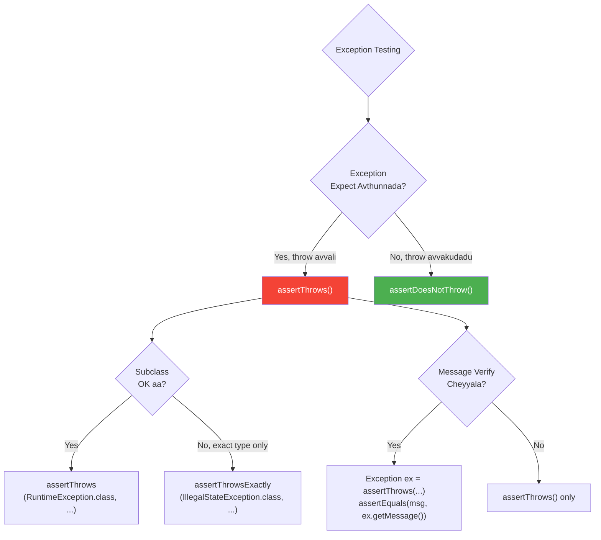

# 💥 JUnit 5 Exception Testing

> **Mawa, "ee code exception throw chestunda?" ani verify cheyyali - ikkada unnay anni methods!**

---

## 🤔 Why Test Exceptions?

```
Real Life:
🏧 ATM: Withdraw ₹10,000 but balance is ₹5,000
Expected: "Insufficient Balance" error
Not Expected: Money dispense avvadam!

Exception testing = Error handling correct ga unda verify!
```

---

## 📋 Exception Assertions

| Method | Purpose |
|--------|---------|
| `assertThrows(Class, Executable)` | Exception throw avvali |
| `assertDoesNotThrow(Executable)` | Exception throw avvakudadu |
| `assertThrowsExactly(Class, Executable)` | Exact exception type (no subclass) |

---

## 💻 Code Examples

### 1️⃣ Basic assertThrows

```java
@Test
void shouldThrowException() {
    Calculator calc = new Calculator();
    
    // Assert that divide by zero throws ArithmeticException
    assertThrows(ArithmeticException.class, () -> {
        calc.divide(10, 0);
    });
}

// One-liner version
@Test
void shouldThrowException_oneLiner() {
    assertThrows(IllegalArgumentException.class, 
        () -> service.register(null));
}
```

### 2️⃣ Verify Exception Message

```java
@Test
void shouldThrowWithMessage() {
    // Capture the exception
    IllegalStateException exception = assertThrows(
        IllegalStateException.class,
        () -> userService.register("existing@email.com")
    );
    
    // Verify the message
    assertEquals("Email already registered", exception.getMessage());
    
    // Or use contains for partial match
    assertTrue(exception.getMessage().contains("already"));
}
```

### 3️⃣ assertThrowsExactly - No Subclasses

```java
@Test
void shouldThrowExactType() {
    // assertThrows - Accepts subclasses too
    assertThrows(RuntimeException.class, () -> {
        throw new IllegalStateException();  // ✅ PASSES (subclass)
    });
    
    // assertThrowsExactly - ONLY exact type
    assertThrowsExactly(RuntimeException.class, () -> {
        throw new IllegalStateException();  // ❌ FAILS (not exact)
    });
    
    assertThrowsExactly(IllegalStateException.class, () -> {
        throw new IllegalStateException();  // ✅ PASSES
    });
}
```

### 4️⃣ assertDoesNotThrow

```java
@Test
void shouldNotThrowException() {
    User validUser = new User("John", "john@test.com");
    
    // Verify no exception is thrown
    assertDoesNotThrow(() -> {
        userService.save(validUser);
    });
    
    // With return value
    User result = assertDoesNotThrow(() -> 
        userService.findById(1L));
    assertNotNull(result);
}
```

---

## 📊 Decision Diagram



---

## 🎯 Real-World Scenarios

### Scenario 1: Validation Exception
```java
@Test
void shouldThrowForInvalidEmail() {
    IllegalArgumentException ex = assertThrows(
        IllegalArgumentException.class,
        () -> userService.register("invalid-email")
    );
    assertTrue(ex.getMessage().contains("Invalid email"));
}
```

### Scenario 2: Business Logic Exception
```java
@Test
void shouldThrowForInsufficientBalance() {
    Account account = new Account(1000);  // Balance: 1000
    
    InsufficientBalanceException ex = assertThrows(
        InsufficientBalanceException.class,
        () -> account.withdraw(2000)  // Try to withdraw 2000
    );
    
    assertEquals(1000, ex.getCurrentBalance());
    assertEquals(2000, ex.getRequestedAmount());
}
```

### Scenario 3: Nested Exception Cause
```java
@Test
void shouldVerifyExceptionCause() {
    ServiceException ex = assertThrows(
        ServiceException.class,
        () -> orderService.placeOrder(invalidOrder)
    );
    
    // Verify root cause
    Throwable cause = ex.getCause();
    assertInstanceOf(DatabaseException.class, cause);
}
```

---

## ⚠️ Common Mistakes

### ❌ Mistake 1: Catching exception yourself
```java
@Test
void wrongWay() {
    try {
        service.methodThatThrows();
        fail("Should have thrown!");  // Easy to forget!
    } catch (Exception e) {
        // ...
    }
}

// ✅ CORRECT
@Test
void rightWay() {
    assertThrows(Exception.class, () -> service.methodThatThrows());
}
```

### ❌ Mistake 2: Wrong exception type
```java
@Test
void wrongExceptionType() {
    // Code throws IllegalStateException
    // But you expect IllegalArgumentException
    assertThrows(IllegalArgumentException.class, 
        () -> service.process());  // ❌ FAILS!
}
```

---

## 🏢 Enterprise Pattern

```java
@ParameterizedTest
@MethodSource("invalidInputProvider")
void shouldThrowForAllInvalidInputs(Object input, Class<? extends Exception> expectedEx) {
    assertThrows(expectedEx, () -> service.process(input));
}

static Stream<Arguments> invalidInputProvider() {
    return Stream.of(
        Arguments.of(null, NullPointerException.class),
        Arguments.of("", IllegalArgumentException.class),
        Arguments.of(-1, IllegalStateException.class)
    );
}
```

---

## 😂 Memory Trick

```
assertThrows = "THROWs avutunda?" 🤔
assertDoesNotThrow = "Throw AVVAKUDADU!" 🚫

Exception message verify:
Exception ex = assertThrows(...) → ex.getMessage()
"Exception pattukuni, message chadvu!"
```

---

## 🔗 Related Topics

- [Assertions](./02-assertions.md) - Basic assertions
- [Parameterized](./04-parameterized.md) - Multiple exception scenarios
- [Your Code](file:///d:/Antigravity_Projects/Junit_Mockito_MockMVC/src/test/java/com/learning/junit5/Part2_ExceptionTestingTest.java) - See it in action!
