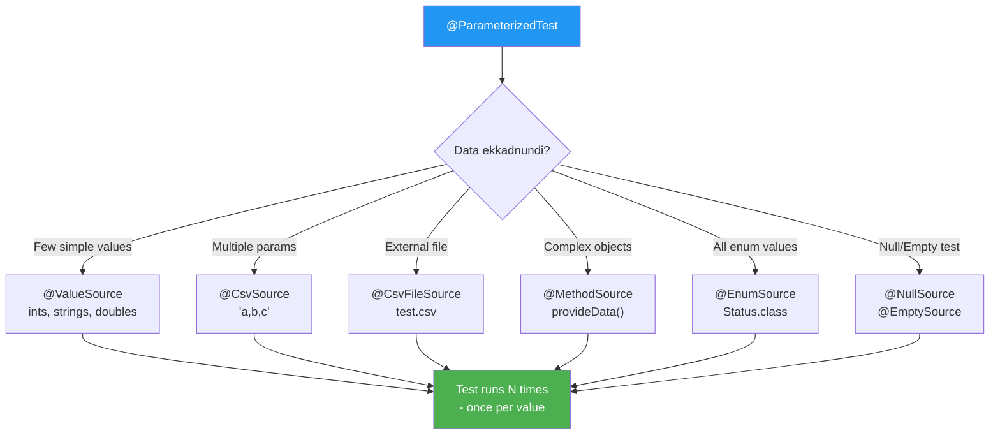

# 🔁 JUnit 5 Parameterized Tests

> **Mawa, same test logic different values tho run cheyyali - copy paste vaddu, parameterized vadali!**

---

## 🤔 Why Parameterized Tests?

```
❌ Without Parameterized (Code Duplication):
@Test void testAdd_1_2() { assertEquals(3, calc.add(1, 2)); }
@Test void testAdd_5_5() { assertEquals(10, calc.add(5, 5)); }
@Test void testAdd_0_0() { assertEquals(0, calc.add(0, 0)); }
// 100 more...

✅ With Parameterized (Clean!):
@ParameterizedTest
@CsvSource({"1,2,3", "5,5,10", "0,0,0"})
void testAdd(int a, int b, int expected) {
    assertEquals(expected, calc.add(a, b));
}
// One test, 100 values!
```

---

## 📋 Data Sources Reference

| Annotation | Use Case | Example |
|------------|----------|---------|
| `@ValueSource` | Single param, simple values | `@ValueSource(ints = {1,2,3})` |
| `@NullSource` | Test with null | `@NullSource` |
| `@EmptySource` | Test with empty | `@EmptySource` |
| `@NullAndEmptySource` | Both null and empty | `@NullAndEmptySource` |
| `@CsvSource` | Multiple params, inline | `@CsvSource({"a,b,c", "x,y,z"})` |
| `@CsvFileSource` | Multiple params, external file | `@CsvFileSource(files = "data.csv")` |
| `@MethodSource` | Complex objects | `@MethodSource("provideData")` |
| `@EnumSource` | All enum values | `@EnumSource(Status.class)` |
| `@ArgumentsSource` | Custom provider class | `@ArgumentsSource(MyProvider.class)` |

---

## 📊 Decision Diagram



---

## 💻 Code Examples

### 1️⃣ @ValueSource - Single Parameter

```java
// Integers
@ParameterizedTest
@ValueSource(ints = {1, 2, 3, 4, 5})
void testPositiveNumbers(int number) {
    assertTrue(number > 0);
}

// Strings
@ParameterizedTest
@ValueSource(strings = {"hello", "world", "junit"})
void testNonEmptyStrings(String text) {
    assertFalse(text.isEmpty());
}

// Doubles
@ParameterizedTest
@ValueSource(doubles = {1.5, 2.5, 3.5})
void testDecimalNumbers(double value) {
    assertTrue(value > 1.0);
}
```

### 2️⃣ @NullSource, @EmptySource

```java
// Test null handling
@ParameterizedTest
@NullSource
void testNullInput(String input) {
    assertThrows(NullPointerException.class, 
        () -> service.process(input));
}

// Test empty handling
@ParameterizedTest
@EmptySource
void testEmptyInput(String input) {
    assertThrows(IllegalArgumentException.class, 
        () -> service.process(input));
}

// Both together
@ParameterizedTest
@NullAndEmptySource
@ValueSource(strings = {"  ", "\t", "\n"})
void testBlankStrings(String input) {
    assertTrue(input == null || input.isBlank());
}
```

### 3️⃣ @CsvSource - Multiple Parameters

```java
// Basic CSV
@ParameterizedTest
@CsvSource({
    "1, 2, 3",       // 1 + 2 = 3
    "10, 20, 30",    // 10 + 20 = 30
    "-1, 1, 0",      // -1 + 1 = 0
    "0, 0, 0"        // 0 + 0 = 0
})
void testAddition(int a, int b, int expected) {
    assertEquals(expected, calculator.add(a, b));
}

// With Strings (use quotes for special chars)
@ParameterizedTest
@CsvSource({
    "John, john@test.com, true",
    "'Jane Doe', jane@test.com, true",
    "'', '', false"  // Empty strings
})
void testUserValidation(String name, String email, boolean expected) {
    assertEquals(expected, validator.isValid(name, email));
}

// Custom delimiter
@ParameterizedTest
@CsvSource(value = {
    "apple | 5 | FRUIT",
    "carrot | 10 | VEGETABLE"
}, delimiter = '|')
void testProducts(String name, int quantity, String category) {
    // ...
}
```

### 4️⃣ @CsvFileSource - External File

```java
// src/test/resources/test-data.csv
// name,email,expected
// John,john@test.com,true
// ,invalid,false

@ParameterizedTest
@CsvFileSource(
    resources = "/test-data.csv",
    numLinesToSkip = 1  // Skip header row!
)
void testFromFile(String name, String email, boolean expected) {
    assertEquals(expected, validator.isValid(name, email));
}
```

### 5️⃣ @MethodSource - Complex Objects

```java
@ParameterizedTest
@MethodSource("provideUsersForValidation")
void testUserValidation(User user, boolean expected) {
    assertEquals(expected, validator.isValid(user));
}

// Method must be static and return Stream<Arguments>
static Stream<Arguments> provideUsersForValidation() {
    return Stream.of(
        Arguments.of(new User("John", "john@test.com"), true),
        Arguments.of(new User("", "invalid"), false),
        Arguments.of(new User(null, null), false)
    );
}

// Alternative: Single param (no Arguments wrapper)
@ParameterizedTest
@MethodSource("provideNumbers")
void testNumbers(int number) {
    assertTrue(number > 0);
}

static IntStream provideNumbers() {
    return IntStream.range(1, 10);
}
```

### 6️⃣ @EnumSource - All Enum Values

```java
enum Status { PENDING, ACTIVE, INACTIVE, DELETED }

// Test all enum values
@ParameterizedTest
@EnumSource(Status.class)
void testAllStatuses(Status status) {
    assertNotNull(status.name());
}

// Include specific values
@ParameterizedTest
@EnumSource(value = Status.class, names = {"ACTIVE", "INACTIVE"})
void testActiveStatuses(Status status) {
    // Only ACTIVE and INACTIVE
}

// Exclude specific values
@ParameterizedTest
@EnumSource(value = Status.class, mode = EnumSource.Mode.EXCLUDE, 
            names = {"DELETED"})
void testNonDeletedStatuses(Status status) {
    // All except DELETED
}
```

---

## 🎨 Display Names

```java
// Custom name for each run
@ParameterizedTest(name = "{0} + {1} = {2}")
@CsvSource({"1,2,3", "5,5,10"})
void testAddition(int a, int b, int expected) {
    assertEquals(expected, a + b);
}
// Output:
// ✓ 1 + 2 = 3
// ✓ 5 + 5 = 10

// With index
@ParameterizedTest(name = "Run {index}: value={0}")
@ValueSource(ints = {1, 2, 3})
void testNumbers(int num) { }
// Output:
// ✓ Run 1: value=1
// ✓ Run 2: value=2
```

---

## 🏢 Enterprise Patterns

### Pattern 1: Boundary Value Testing
```java
@ParameterizedTest
@ValueSource(ints = {0, 1, 99, 100, 101, -1})
void testAgeValidation(int age) {
    if (age >= 0 && age <= 100) {
        assertDoesNotThrow(() -> validator.validateAge(age));
    } else {
        assertThrows(IllegalArgumentException.class, 
            () -> validator.validateAge(age));
    }
}
```

### Pattern 2: Multiple Scenarios
```java
@ParameterizedTest
@MethodSource("emailValidationScenarios")
void testEmailValidation(String email, boolean valid, String reason) {
    assertEquals(valid, validator.isValidEmail(email), reason);
}

static Stream<Arguments> emailValidationScenarios() {
    return Stream.of(
        Arguments.of("test@example.com", true, "Standard email"),
        Arguments.of("test@sub.example.com", true, "Subdomain email"),
        Arguments.of("test", false, "No @ symbol"),
        Arguments.of("@example.com", false, "No local part"),
        Arguments.of("test@", false, "No domain"),
        Arguments.of("", false, "Empty string")
    );
}
```

---

## ⚠️ Common Mistakes

### ❌ Mistake: @MethodSource method not static
```java
@ParameterizedTest
@MethodSource("getData")
void test(int num) { }

Stream<Integer> getData() { }  // ❌ Not static!
static Stream<Integer> getData() { }  // ✅ Correct
```

### ❌ Mistake: Wrong argument count
```java
@ParameterizedTest
@CsvSource({"1,2,3"})  // 3 values
void test(int a, int b) { }  // ❌ Only 2 params!
```

---

## 😂 Memory Trick

```
@ValueSource = "VALUE single ga"
@CsvSource = "CSV = Comma Separated Values"
@MethodSource = "Complex objects? METHOD se lao!"
@EnumSource = "ENUM ke saare values"

Rule: Same logic + Different data = @ParameterizedTest
```

---

## 🔗 Related Topics

- [Assertions](./02-assertions.md) - What to assert
- [Nested Tests](./05-nested-tests.md) - Organize parameterized tests
- [Your Code](file:///d:/Antigravity_Projects/Junit_Mockito_MockMVC/src/test/java/com/learning/junit5/Part5_ParameterizedTestsTest.java) - See it in action!
