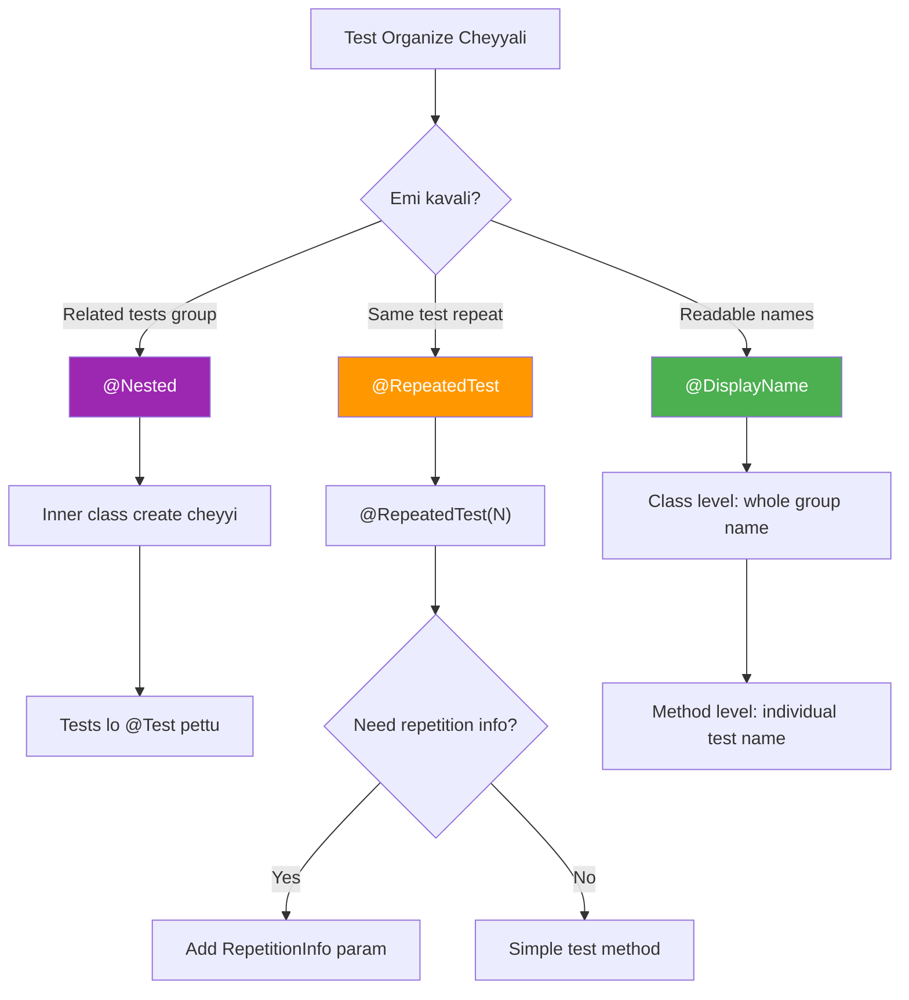

# 📦 JUnit 5 Nested & Repeated Tests

> **Mawa, tests ni organize cheyyali @Nested tho, same test repeat cheyyali @RepeatedTest tho!**

---

## 🤔 Why Nested Tests?

```
❌ Flat Structure (Hard to read):
testCreate_success
testCreate_failDuplicate  
testCreate_failInvalid
testUpdate_success
testUpdate_failNotFound
testDelete_success
testDelete_failNotFound

✅ Nested Structure (Organized!):
UserServiceTest
├── CreateOperations
│   ├── success
│   ├── failDuplicate
│   └── failInvalid
├── UpdateOperations
│   ├── success
│   └── failNotFound
└── DeleteOperations
    ├── success
    └── failNotFound
```

---

## 📋 Quick Reference

| Annotation | Purpose |
|------------|---------|
| `@Nested` | Group related tests in inner class |
| `@DisplayName` | Human-readable name |
| `@RepeatedTest` | Run same test N times |

---

## 💻 @Nested Examples

### 1️⃣ Basic Nested Structure

```java
@DisplayName("Calculator Tests")
class CalculatorTest {
    
    private Calculator calc;
    
    @BeforeEach
    void setup() {
        calc = new Calculator();
    }
    
    @Nested
    @DisplayName("Addition Operations")
    class AdditionTests {
        
        @Test
        @DisplayName("Should add positive numbers")
        void addPositive() {
            assertEquals(5, calc.add(2, 3));
        }
        
        @Test
        @DisplayName("Should add negative numbers")
        void addNegative() {
            assertEquals(-5, calc.add(-2, -3));
        }
    }
    
    @Nested
    @DisplayName("Division Operations")
    class DivisionTests {
        
        @Test
        @DisplayName("Should divide correctly")
        void divideSuccess() {
            assertEquals(5, calc.divide(10, 2));
        }
        
        @Test
        @DisplayName("Should throw for divide by zero")
        void divideByZero() {
            assertThrows(ArithmeticException.class, 
                () -> calc.divide(10, 0));
        }
    }
}
```

**Test Output:**
```
Calculator Tests
├── Addition Operations
│   ├── ✓ Should add positive numbers
│   └── ✓ Should add negative numbers
└── Division Operations
    ├── ✓ Should divide correctly
    └── ✓ Should throw for divide by zero
```

### 2️⃣ BDD Style (Given-When-Then)

```java
@DisplayName("UserService")
class UserServiceTest {
    
    @Nested
    @DisplayName("When registering a user")
    class WhenRegistering {
        
        @Nested
        @DisplayName("Given valid input")
        class GivenValidInput {
            
            @Test
            @DisplayName("Then should create user")
            void shouldCreateUser() {
                User user = service.register("John", "john@test.com");
                assertNotNull(user.getId());
            }
            
            @Test
            @DisplayName("Then should send welcome email")
            void shouldSendEmail() {
                service.register("John", "john@test.com");
                verify(emailService).sendWelcome("john@test.com");
            }
        }
        
        @Nested
        @DisplayName("Given invalid input")
        class GivenInvalidInput {
            
            @Test
            @DisplayName("Then should throw for null name")
            void shouldThrowForNullName() {
                assertThrows(IllegalArgumentException.class,
                    () -> service.register(null, "john@test.com"));
            }
        }
    }
}
```

**Test Output:**
```
UserService
└── When registering a user
    ├── Given valid input
    │   ├── ✓ Then should create user
    │   └── ✓ Then should send welcome email
    └── Given invalid input
        └── ✓ Then should throw for null name
```

### 3️⃣ Lifecycle in Nested Classes

```java
class NestedLifecycleDemo {
    
    // Runs for ALL tests (outer + inner)
    @BeforeEach
    void outerSetup() {
        System.out.println("Outer BeforeEach");
    }
    
    @Nested
    class InnerClass {
        
        // Runs for inner class tests ONLY
        @BeforeEach
        void innerSetup() {
            System.out.println("Inner BeforeEach");
        }
        
        @Test
        void test() {
            // Output:
            // 1. Outer BeforeEach
            // 2. Inner BeforeEach
            // 3. Test runs
        }
    }
}
```

---

## 💻 @RepeatedTest Examples

### 1️⃣ Basic Repeated Test

```java
@RepeatedTest(5)  // Runs 5 times
void testRandom() {
    int result = randomService.generate();
    assertTrue(result >= 0 && result <= 100);
}

// With custom name
@RepeatedTest(value = 5, name = "Run {currentRepetition} of {totalRepetitions}")
void testWithName() { }
// Output:
// ✓ Run 1 of 5
// ✓ Run 2 of 5
// ...
```

### 2️⃣ Access Repetition Info

```java
@RepeatedTest(3)
void testWithInfo(RepetitionInfo info) {
    int current = info.getCurrentRepetition();  // 1, 2, 3
    int total = info.getTotalRepetitions();     // 3
    
    System.out.println("Run " + current + " of " + total);
}

// Use for different data per repetition
@RepeatedTest(3)
void testWithDifferentData(RepetitionInfo info) {
    int[] testData = {10, 20, 30};
    int data = testData[info.getCurrentRepetition() - 1];
    
    assertTrue(data > 0);
}
```

### 3️⃣ Flaky Test Detection

```java
// If a test sometimes fails, repeat to detect flakiness
@RepeatedTest(10)  // Run 10 times
void testPotentiallyFlaky() {
    // If it fails even once in 10 runs, you have a flaky test!
    boolean result = unreliableService.process();
    assertTrue(result);
}
```

---

## 📊 Decision Diagram



---

## 🏢 Enterprise Patterns

### Pattern 1: Feature-Based Organization
```java
@DisplayName("Order Service")
class OrderServiceTest {
    
    @Nested
    @DisplayName("Create Order")
    class CreateOrder {
        @Nested class HappyPath { /* success cases */ }
        @Nested class ValidationErrors { /* invalid input */ }
        @Nested class BusinessErrors { /* insufficient stock */ }
    }
    
    @Nested
    @DisplayName("Cancel Order")
    class CancelOrder {
        @Nested class HappyPath { /* success cases */ }
        @Nested class Errors { /* already shipped */ }
    }
}
```

### Pattern 2: State-Based Testing
```java
@DisplayName("Shopping Cart")
class ShoppingCartTest {
    
    @Nested
    @DisplayName("When cart is empty")
    class WhenEmpty {
        @Test void shouldHaveZeroTotal() { }
        @Test void shouldHaveNoItems() { }
    }
    
    @Nested
    @DisplayName("When cart has items")
    class WhenHasItems {
        @BeforeEach void addItems() { cart.add(item1); }
        
        @Test void shouldCalculateTotal() { }
        @Test void shouldListItems() { }
        
        @Nested
        @DisplayName("And applying discount")
        class WithDiscount {
            @Test void shouldReduceTotal() { }
        }
    }
}
```

---

## ⚠️ Common Mistakes

### ❌ Mistake: @BeforeAll in non-static nested
```java
@Nested
class Inner {
    @BeforeAll
    static void setup() { }  // ❌ Nested classes can't have static by default!
}

// ✅ Fix: Use @TestInstance
@Nested
@TestInstance(Lifecycle.PER_CLASS)
class Inner {
    @BeforeAll
    void setup() { }  // ✅ Now works (non-static)
}
```

### ❌ Mistake: Too deep nesting
```java
@Nested class A {
    @Nested class B {
        @Nested class C {
            @Nested class D { }  // ❌ Too deep!
        }
    }
}
// Rule: Max 2-3 levels deep
```

---

## 😂 Memory Trick

```
@Nested = "Tests ko NEST karo bird's nest jaisa! 🪺"
@RepeatedTest = "REPEAT repeat repeat! 🔄"
@DisplayName = "DISPLAY naam dikhao! 📺"

BDD Style = Given-When-Then
"GIVEN situation, WHEN action, THEN expectation"
```

---

## 🔗 Related Topics

- [Lifecycle](./01-lifecycle.md) - @BeforeEach in nested
- [Parameterized](./04-parameterized.md) - Multiple values
- [Your Code](file:///d:/Antigravity_Projects/Junit_Mockito_MockMVC/src/test/java/com/learning/junit5/Part7_NestedTestsTest.java) - See it in action!
