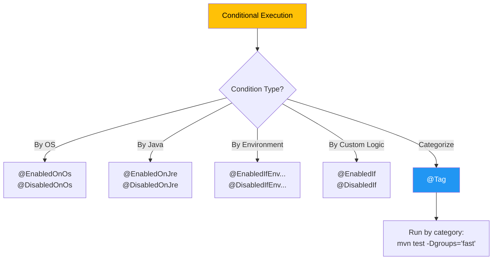

# 🎚️ JUnit 5 Conditional & Tags

> **Mawa, certain conditions lo matrame test run cheyyali - OS, Java version, environment based!**

---

## 🤔 Why Conditional Execution?

```
Real Scenarios:
🪟 Windows-only test: File path separators
☕ Java 17-only test: New language features
🚀 CI-only test: Integration tests
🐢 Local-skip test: Slow performance tests
```

---

## 📋 Conditional Annotations

| Annotation | Purpose | Example |
|------------|---------|---------|
| `@EnabledOnOs` | Run only on specific OS | Windows, Mac, Linux |
| `@DisabledOnOs` | Skip on specific OS | |
| `@EnabledOnJre` | Run on specific Java | Java 17, 21 |
| `@DisabledOnJre` | Skip on specific Java | |
| `@EnabledIfEnvironmentVariable` | Run if env var matches | CI=true |
| `@DisabledIfEnvironmentVariable` | Skip if env var matches | |
| `@EnabledIfSystemProperty` | Run if sys prop matches | os.arch=64 |
| `@DisabledIfSystemProperty` | Skip if sys prop matches | |
| `@EnabledIf` | Custom condition | Method returns true |
| `@DisabledIf` | Custom condition | |
| `@Tag` | Categorize tests | "fast", "slow" |
| `@Disabled` | Always skip | Bug pending |

---

## 💻 Code Examples

### 1️⃣ OS-Based Conditions

```java
// Run only on Windows
@Test
@EnabledOnOs(OS.WINDOWS)
void windowsOnlyTest() {
    Path path = Paths.get("C:\\Users\\test");
    assertTrue(path.toString().contains("\\"));
}

// Run only on Mac or Linux
@Test
@EnabledOnOs({OS.MAC, OS.LINUX})
void unixOnlyTest() {
    Path path = Paths.get("/home/user");
    assertTrue(path.toString().startsWith("/"));
}

// Skip on Windows
@Test
@DisabledOnOs(OS.WINDOWS)
void notOnWindows() {
    // Skip because Windows uses different line endings
}
```

### 2️⃣ Java Version Conditions

```java
// Run only on Java 17+
@Test
@EnabledOnJre(JRE.JAVA_17)
void java17Features() {
    // Test record classes, sealed classes, etc.
}

// Run on Java 17 or higher
@Test
@EnabledForJreRange(min = JRE.JAVA_17)
void java17Plus() {
    // Pattern matching, etc.
}

// Skip on old Java
@Test
@DisabledOnJre({JRE.JAVA_8, JRE.JAVA_11})
void notOnOldJava() {
    // Uses new features
}
```

### 3️⃣ Environment Variable Conditions

```java
// Run only in CI environment
@Test
@EnabledIfEnvironmentVariable(named = "CI", matches = "true")
void ciOnlyTest() {
    // Integration tests that need CI resources
}

// Skip on production-like environments
@Test
@DisabledIfEnvironmentVariable(named = "ENV", matches = "prod.*")
void notOnProduction() {
    // Destructive tests
}

// Regex matching
@Test
@EnabledIfEnvironmentVariable(named = "USER", matches = ".*admin.*")
void adminUserTest() {
    // Needs admin privileges
}
```

### 4️⃣ System Property Conditions

```java
// Run only on 64-bit systems
@Test
@EnabledIfSystemProperty(named = "os.arch", matches = ".*64.*")
void require64Bit() {
    // Heavy memory tests
}

// Check custom property
@Test
@EnabledIfSystemProperty(named = "test.integration", matches = "true")
void integrationTest() {
    // Run: mvn test -Dtest.integration=true
}
```

### 5️⃣ Custom Conditions

```java
// Using method reference
@Test
@EnabledIf("customCondition")
void conditionalTest() {
    // Only runs if customCondition() returns true
}

boolean customCondition() {
    return Runtime.getRuntime().maxMemory() > 1_000_000_000;  // 1GB+
}

// Using expression
@Test
@DisabledIf("2 * 3 == 6")  // Always disabled!
void neverRuns() { }
```

---

## 🏷️ @Tag - Categorizing Tests

### Basic Usage:

```java
// Mark fast tests
@Tag("fast")
@Test
void quickTest() { }

// Mark slow tests
@Tag("slow")
@Test
void longRunningTest() { }

// Mark integration tests
@Tag("integration")
@Test
void integrationTest() { }

// Multiple tags
@Tag("slow")
@Tag("database")
@Test
void slowDbTest() { }
```

### Running by Tag:

```bash
# Run only fast tests
mvn test -Dgroups="fast"

# Run only integration tests
mvn test -Dgroups="integration"

# Exclude slow tests
mvn test -DexcludedGroups="slow"

# Complex combinations
mvn test -Dgroups="fast | integration" -DexcludedGroups="staging"
```

### Tag Inheritance (Class Level):

```java
@Tag("integration")  // All tests in this class
class IntegrationTests {
    
    @Test
    void test1() { }  // Has "integration" tag
    
    @Test
    void test2() { }  // Has "integration" tag
    
    @Tag("slow")      // Additional tag
    @Test
    void slowIntegrationTest() { }  // Has both tags
}
```

---

## 📊 Decision Diagram



---

## 🏢 Enterprise Patterns

### Pattern 1: Environment-Based Test Suites
```java
// Local development tests
@Tag("local")
@DisabledIfEnvironmentVariable(named = "CI", matches = "true")
class LocalTests { }

// CI-only tests
@Tag("ci")
@EnabledIfEnvironmentVariable(named = "CI", matches = "true")
class CITests { }

// Production smoke tests
@Tag("smoke")
class SmokeTests { }
```

### Pattern 2: Custom Composed Annotations
```java
// Create reusable annotation
@Target(ElementType.METHOD)
@Retention(RetentionPolicy.RUNTIME)
@Tag("integration")
@EnabledIfEnvironmentVariable(named = "CI", matches = "true")
@interface CIIntegrationTest { }

// Use it simply
@CIIntegrationTest
@Test
void myTest() { }
```

### Pattern 3: Performance Test Isolation
```java
@Tag("performance")
@EnabledIfSystemProperty(named = "test.perf", matches = "true")
@Timeout(value = 30, unit = TimeUnit.SECONDS)
class PerformanceTests {
    
    @RepeatedTest(100)
    void loadTest() { }
}
```

---

## 🎨 @Disabled - Always Skip

```java
// Skip with reason
@Disabled("Bug #123 - Fix pending")
@Test
void brokenTest() { }

// Skip entire class
@Disabled("Feature not ready")
class NewFeatureTests { }

// Skip until date
@Disabled("Wait for API v2 - Expected: 2024-01-01")
@Test
void futureApiTest() { }
```

---

## ⚠️ Common Mistakes

### ❌ Mistake: Forgetting to run with tags
```bash
# This runs ALL tests, ignoring tags!
mvn test

# ✅ Correct: Specify groups
mvn test -Dgroups="fast"
```

### ❌ Mistake: Wrong regex
```java
@EnabledIfEnvironmentVariable(named = "CI", matches = "true")
// Works for CI=true

@EnabledIfEnvironmentVariable(named = "CI", matches = ".*")
// Works for any non-null value
```

---

## 😂 Memory Trick

```
@EnabledOnOs = "OS pe ENABLE karo"
@DisabledOnJre = "Purana Java pe DISABLE karo"
@Tag = "TAG lagao, baad mein filter maro"
@Disabled = "Abhi DISABLE, baad mein fix karenge"

CI Test = mvn test -Dgroups="integration"
Local Quick = mvn test -Dgroups="fast"
```

---

## 🔗 Related Topics

- [Parameterized](./04-parameterized.md) - Different data, same logic
- [Enterprise Patterns](./07-enterprise-patterns.md) - CI/CD setup
- [Your Code](file:///d:/Antigravity_Projects/Junit_Mockito_MockMVC/src/test/java/com/learning/junit5/Part9_AdvancedAnnotationsTest.java) - See it in action!
