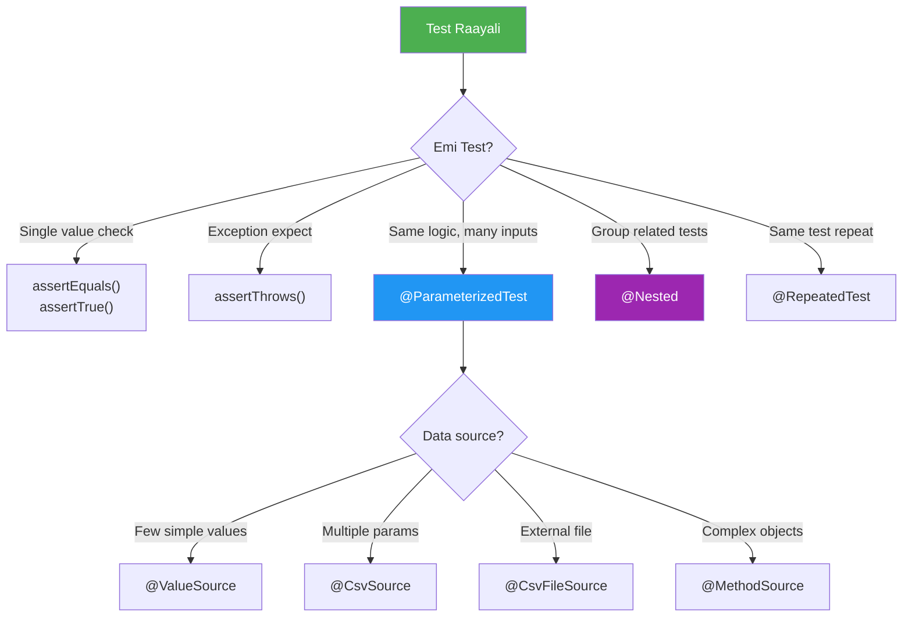

# 🟢 JUnit 5 Complete Guide

> **Mawa, JUnit 5 anni concepts ee folder lo unnay!**
> **Brush-up to Advanced - Enterprise Ready!**

---

## 📚 Topics Index

| # | Topic | File | Quick Link |
|---|-------|------|------------|
| 1 | 🔄 **Lifecycle Annotations** | [01-lifecycle.md](./01-lifecycle.md) | @BeforeAll, @BeforeEach, @AfterEach, @AfterAll |
| 2 | ✅ **Assertions** | [02-assertions.md](./02-assertions.md) | assertEquals, assertTrue, assertAll |
| 3 | 💥 **Exception Testing** | [03-exceptions.md](./03-exceptions.md) | assertThrows, assertDoesNotThrow |
| 4 | 🔁 **Parameterized Tests** | [04-parameterized.md](./04-parameterized.md) | @ValueSource, @CsvSource, @MethodSource |
| 5 | 📦 **Nested & Repeated** | [05-nested-tests.md](./05-nested-tests.md) | @Nested, @RepeatedTest, @DisplayName |
| 6 | 🎚️ **Conditional & Tags** | [06-conditional.md](./06-conditional.md) | @EnabledOnOs, @Tag, @Disabled |
| 7 | 🏢 **Enterprise Patterns** | [07-enterprise-patterns.md](./07-enterprise-patterns.md) | Real-world examples |

---

## 🤔 Decision Flowchart



---

## 🔗 Your Test Files

| Topic | Test File |
|-------|-----------|
| Lifecycle | [Part1_LifecycleAndBasicAssertionsTest.java](file:///d:/Antigravity_Projects/Junit_Mockito_MockMVC/src/test/java/com/learning/junit5/Part1_LifecycleAndBasicAssertionsTest.java) |
| Exceptions | [Part2_ExceptionTestingTest.java](file:///d:/Antigravity_Projects/Junit_Mockito_MockMVC/src/test/java/com/learning/junit5/Part2_ExceptionTestingTest.java) |
| Display/Disabled | [Part3_DisplayNameAndDisabledTest.java](file:///d:/Antigravity_Projects/Junit_Mockito_MockMVC/src/test/java/com/learning/junit5/Part3_DisplayNameAndDisabledTest.java) |
| Assertions | [Part4_PrimitivesVsObjectsAssertionsTest.java](file:///d:/Antigravity_Projects/Junit_Mockito_MockMVC/src/test/java/com/learning/junit5/Part4_PrimitivesVsObjectsAssertionsTest.java) |
| Parameterized | [Part5_ParameterizedTestsTest.java](file:///d:/Antigravity_Projects/Junit_Mockito_MockMVC/src/test/java/com/learning/junit5/Part5_ParameterizedTestsTest.java) |
| CSV File | [Part6_CsvFileSourceTest.java](file:///d:/Antigravity_Projects/Junit_Mockito_MockMVC/src/test/java/com/learning/junit5/Part6_CsvFileSourceTest.java) |
| Nested | [Part7_NestedTestsTest.java](file:///d:/Antigravity_Projects/Junit_Mockito_MockMVC/src/test/java/com/learning/junit5/Part7_NestedTestsTest.java) |
| Repeated | [Part8_RepeatedTestsTest.java](file:///d:/Antigravity_Projects/Junit_Mockito_MockMVC/src/test/java/com/learning/junit5/Part8_RepeatedTestsTest.java) |
| Advanced | [Part9_AdvancedAnnotationsTest.java](file:///d:/Antigravity_Projects/Junit_Mockito_MockMVC/src/test/java/com/learning/junit5/Part9_AdvancedAnnotationsTest.java) |

---

## 🏃 Quick Commands

```powershell
# Run all JUnit 5 tests
.\mvnw.cmd test -Dtest="Part*Test"

# Run specific part
.\mvnw.cmd test -Dtest=Part1_LifecycleAndBasicAssertionsTest

# Run by tag
.\mvnw.cmd test -Dgroups="fast"
```
