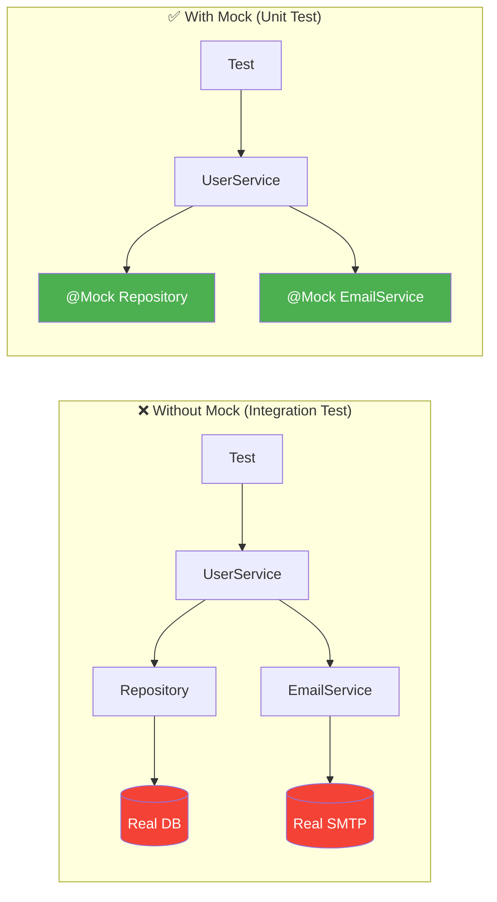
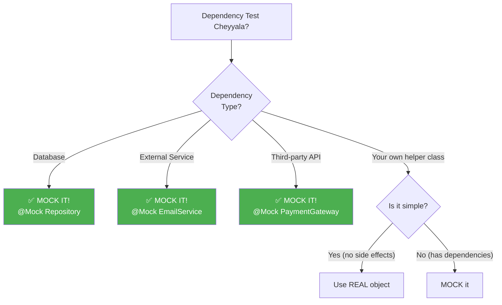

# 🤔 Why Mocking?

> **Mawa, mocking ante enti? Enduku kavali? - Basics nunchi explain chesta!**

---

## 🎯 The Problem: Dependencies

```java
// UserService depends on:
public class UserService {
    private UserRepository repository;  // ← Database
    private EmailService emailService;  // ← External SMTP
    private PaymentGateway payment;     // ← Third-party API
    
    public User register(String name, String email) {
        // 1. Check if email exists (DB call!)
        // 2. Save user (DB call!)
        // 3. Send welcome email (SMTP call!)
        // 4. Charge signup fee (Payment API!)
    }
}
```

**Problem: Unit test lo...**
- ❌ Real database start cheyyala?
- ❌ Real email send cheyyala?
- ❌ Real payment charge cheyyala?

**Answer: NO! Mock cheyyali!**

---

## 💡 What is Mocking?

```
REAL OBJECT              MOCK OBJECT
━━━━━━━━━━━━━━           ━━━━━━━━━━━━━━
UserRepository           UserRepository (FAKE)
├── Connect to DB        ├── No DB connection!
├── Execute SQL          ├── Returns what you tell it
└── Return results       └── Controlled behavior

Mock = Fake object that behaves how WE want!
```

---

## 📊 Visual: With vs Without Mocking



---

## 🎯 Benefits of Mocking

| Benefit | Explanation |
|---------|-------------|
| **Fast** ⚡ | No DB/Network calls = milliseconds |
| **Isolated** 🔒 | Test only YOUR code logic |
| **Controlled** 🎮 | You decide what mock returns |
| **Reliable** ✓ | No flaky network failures |
| **Parallel** 🔀 | No shared database conflicts |

---

## 💻 Real Example

### Without Mock (BAD for unit testing):
```java
@Test
void testRegister() {
    // Need real DB running!
    // Need real SMTP server!
    // Need real Payment gateway!
    User user = userService.register("John", "john@test.com");
    
    // Slow, flaky, requires infrastructure
}
```

### With Mock (GOOD for unit testing):
```java
@ExtendWith(MockitoExtension.class)
class UserServiceTest {
    
    @Mock UserRepository repository;    // FAKE!
    @Mock EmailService emailService;    // FAKE!
    @InjectMocks UserService userService;
    
    @Test
    void testRegister() {
        // Tell mock what to return
        when(repository.existsByEmail("john@test.com")).thenReturn(false);
        when(repository.save(any())).thenReturn(new User(1L, "John"));
        
        // Test YOUR logic
        User user = userService.register("John", "john@test.com");
        
        // Verify interactions
        assertEquals("John", user.getName());
        verify(emailService).sendWelcome("john@test.com");
    }
}
```

---

## 🤔 When to Mock?



### Mock These:
- ✅ Repositories (Database)
- ✅ External Services (Email, SMS)
- ✅ Third-party APIs (Payment, Maps)
- ✅ File System operations
- ✅ Network calls

### DON'T Mock These:
- ❌ Simple value objects (User, Order)
- ❌ Utility classes (StringUtils)
- ❌ The class you're testing!

---

## 📖 Unit Test vs Integration Test

| Aspect | Unit Test (Mock) | Integration Test (Real) |
|--------|------------------|-------------------------|
| **Dependencies** | All mocked | Real (some/all) |
| **Speed** | ⚡ Milliseconds | 🐢 Seconds |
| **Database** | Mocked | Real (Testcontainers) |
| **Purpose** | Test logic | Test connections |
| **When to run** | Every commit | Before deploy |

---

## 🎯 The Testing Strategy

```
╔═══════════════════════════════════════════════════════════════╗
║  SERVICE CLASS                                                ║
║  ┌─────────────────────────────────────────────────────────┐ ║
║  │ userService.register()                                  │ ║
║  │   ├── validate input      ← Test with UNIT TEST        │ ║
║  │   ├── check duplicate     ← Mock repository            │ ║
║  │   ├── save user           ← Mock repository            │ ║
║  │   └── send email          ← Mock email service         │ ║
║  └─────────────────────────────────────────────────────────┘ ║
║                                                               ║
║  Unit Test = Test YOUR logic                                  ║
║  Integration Test = Test DB/Email actually works              ║
╚═══════════════════════════════════════════════════════════════╝
```

---

## 😂 Analogy

```
Mocking = Movie Stunt Double! 🎬

Real Actor = Your code (UserService)
Stunt Double = Mock (Repository)

Director (You) tells stunt double:
"When actor jumps, you catch him"
= when(repo.save()).thenReturn(user)

Movie looks real, but no one gets hurt!
= Test runs fast, no real DB affected!
```

---

## 🔗 Related Topics

- [Mock Basics](./02-mock-basics.md) - How to create mocks
- [Stubbing](./03-stubbing.md) - when/thenReturn
- [Your Code](file:///d:/Antigravity_Projects/Junit_Mockito_MockMVC/src/test/java/com/learning/mockito/Part1_MockBasicsTest.java) - See it in action!
