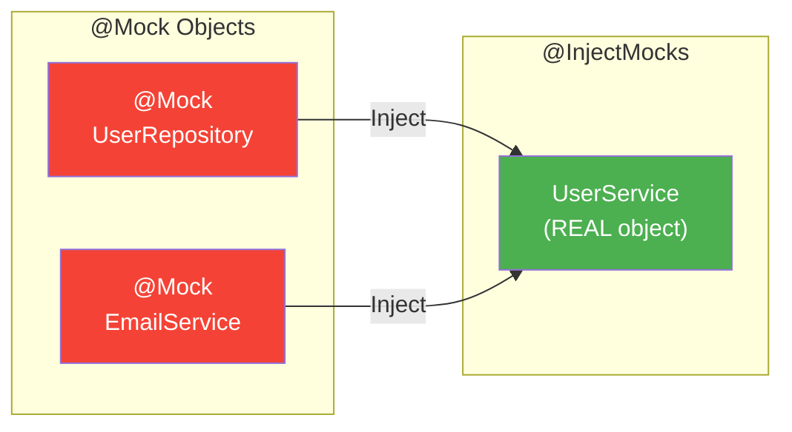
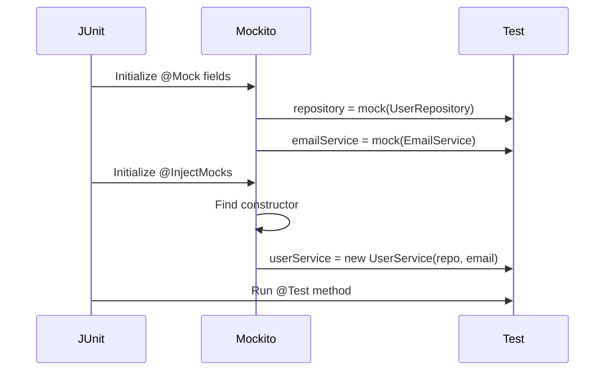

# 🎭 Mockito Basics - @Mock & @InjectMocks

> **Mawa, mock create cheyyali, inject cheyyali - basic setup ikkada!**

---

## 📋 Core Annotations

| Annotation | Purpose |
|------------|---------|
| `@ExtendWith(MockitoExtension.class)` | Enable Mockito in JUnit 5 |
| `@Mock` | Create a mock object |
| `@InjectMocks` | Create real object & inject mocks |
| `@Spy` | Partial mock (real + fake) |
| `@Captor` | Capture arguments |

---

## 💻 Basic Setup

```java
import org.junit.jupiter.api.Test;
import org.junit.jupiter.api.extension.ExtendWith;
import org.mockito.Mock;
import org.mockito.InjectMocks;
import org.mockito.junit.jupiter.MockitoExtension;

@ExtendWith(MockitoExtension.class)  // Step 1: Enable Mockito
class UserServiceTest {
    
    @Mock                              // Step 2: Create FAKE repository
    private UserRepository repository;
    
    @Mock                              // Step 2: Create FAKE email service
    private EmailService emailService;
    
    @InjectMocks                       // Step 3: Create REAL service, inject mocks
    private UserService userService;
    
    @Test
    void testSomething() {
        // userService is REAL
        // userService.repository is MOCK
        // userService.emailService is MOCK
    }
}
```

---

## 📊 How @InjectMocks Works



**Injection methods (in order):**
1. Constructor injection (preferred)
2. Setter injection
3. Field injection

---

## 💻 @Mock Behavior

```java
@Mock
private UserRepository repository;

@Test
void mockDefaultBehavior() {
    // Mocks return "empty" values by default:
    
    repository.findById(1L);           // Returns null
    repository.findAll();              // Returns empty list []
    repository.count();                // Returns 0
    repository.existsByEmail("x");     // Returns false
    repository.save(user);             // Returns null
    
    // Nothing happens - no real DB calls!
}
```

**Default returns:**
| Return Type | Default Value |
|-------------|---------------|
| Object | `null` |
| Collection | Empty collection |
| int, long | `0` |
| boolean | `false` |
| Optional | `Optional.empty()` |

---

## 💻 Complete Example

```java
@ExtendWith(MockitoExtension.class)
class UserServiceTest {
    
    @Mock
    private UserRepository repository;
    
    @Mock
    private EmailService emailService;
    
    @InjectMocks
    private UserService userService;
    
    @Test
    void shouldRegisterUser() {
        // 1. ARRANGE - Tell mock what to return
        when(repository.existsByEmail("john@test.com")).thenReturn(false);
        when(repository.save(any(User.class))).thenAnswer(inv -> {
            User u = inv.getArgument(0);
            u.setId(1L);  // Simulate DB ID generation
            return u;
        });
        
        // 2. ACT - Call the real service method
        User result = userService.register("John", "john@test.com");
        
        // 3. ASSERT - Verify results
        assertNotNull(result);
        assertEquals(1L, result.getId());
        
        // 4. VERIFY - Check mock interactions
        verify(repository).existsByEmail("john@test.com");
        verify(repository).save(any(User.class));
        verify(emailService).sendWelcome("john@test.com");
    }
}
```

---

## 🎯 Alternative: Programmatic Mocks

```java
// Without annotations (less common)
class UserServiceTest {
    
    private UserRepository repository;
    private UserService userService;
    
    @BeforeEach
    void setup() {
        repository = Mockito.mock(UserRepository.class);
        EmailService emailService = Mockito.mock(EmailService.class);
        
        userService = new UserService(repository, emailService);
    }
}
```

---

## ⚠️ Common Mistakes

### ❌ Mistake 1: Missing @ExtendWith
```java
// @ExtendWith(MockitoExtension.class)  ← MISSING!
class MyTest {
    @Mock Repository repo;  // Will be NULL!
}
```

### ❌ Mistake 2: @InjectMocks on Mock
```java
@Mock
@InjectMocks  // ❌ WRONG! Can't be both
private UserService service;
```

### ❌ Mistake 3: Mocking the class under test
```java
@Mock
private UserService service;  // ❌ You're testing this!

// ✅ Correct
@InjectMocks
private UserService service;  // This should be REAL
```

### ❌ Mistake 4: Final classes/methods
```java
@Mock
private final UserRepository repo = null;  // ❌ Can't mock final!

// Mockito can't mock:
// - final classes
// - final methods
// - static methods (need mockito-inline)
// - private methods
```

---

## 🏢 Enterprise Pattern: Constructor Injection

```java
// Production code - Constructor injection (best practice)
public class UserService {
    
    private final UserRepository repository;
    private final EmailService emailService;
    
    public UserService(UserRepository repository, EmailService emailService) {
        this.repository = repository;
        this.emailService = emailService;
    }
}

// Test - @InjectMocks automatically uses constructor
@ExtendWith(MockitoExtension.class)
class UserServiceTest {
    
    @Mock UserRepository repository;
    @Mock EmailService emailService;
    
    @InjectMocks
    UserService userService;  // Constructor called with mocks!
}
```

---

## 📊 Injection Flow



---

## 😂 Memory Trick

```
@Mock = "MOCK banana! Fake banana!" 🍌
@InjectMocks = "INJECT the mocks into real object" 💉

Real ke andar Fake daalo!
UserService (real) ke andar Repository (fake) daalo!
```

---

## 🔗 Related Topics

- [Stubbing](./03-stubbing.md) - when/thenReturn
- [Verification](./04-verification.md) - verify()
- [Your Code](file:///d:/Antigravity_Projects/Junit_Mockito_MockMVC/src/test/java/com/learning/mockito/Part1_MockBasicsTest.java) - See it in action!
