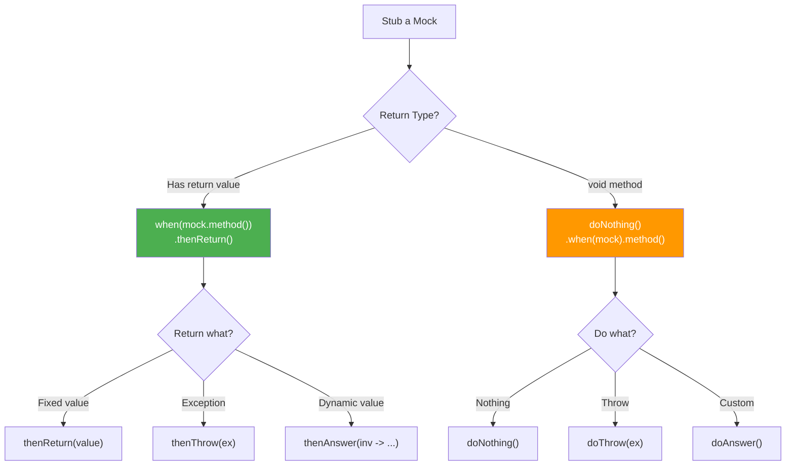

# 🎯 Mockito Stubbing

> **Mawa, mock ki "ye call cheste, ye return chey" ani cheppadam = STUBBING!**

---

## 🤔 What is Stubbing?

```
Without Stubbing:
mock.findById(1L) → returns NULL (default)

With Stubbing:
when(mock.findById(1L)).thenReturn(user);
mock.findById(1L) → returns USER! ✅
```

**Stubbing = Training the mock to return what you want!**

---

## 📋 Stubbing Methods

| Method | Purpose | Example |
|--------|---------|---------|
| `thenReturn(value)` | Return fixed value | `thenReturn(user)` |
| `thenThrow(exception)` | Throw exception | `thenThrow(new RuntimeException())` |
| `thenAnswer(Answer)` | Custom logic | Dynamic return based on input |
| `thenCallRealMethod()` | Call actual method | Partial mocking |

---

## 💻 Code Examples

### 1️⃣ thenReturn - Fixed Value

```java
@Test
void basicStubbing() {
    User user = new User("John", "john@test.com");
    
    // Single return
    when(repository.findById(1L)).thenReturn(Optional.of(user));
    
    // Now it returns what we told it!
    Optional<User> result = repository.findById(1L);
    assertTrue(result.isPresent());
    assertEquals("John", result.get().getName());
}

// Multiple calls - different returns
@Test
void consecutiveReturns() {
    when(repository.count())
        .thenReturn(0L)      // First call
        .thenReturn(1L)      // Second call
        .thenReturn(2L);     // Third and subsequent
    
    assertEquals(0L, repository.count());  // First
    assertEquals(1L, repository.count());  // Second
    assertEquals(2L, repository.count());  // Third
    assertEquals(2L, repository.count());  // Fourth (last value repeats)
}
```

### 2️⃣ thenThrow - Exception

```java
@Test
void stubException() {
    // Throw exception when called
    when(repository.findById(999L))
        .thenThrow(new EntityNotFoundException("User not found"));
    
    // Verify exception is thrown
    assertThrows(EntityNotFoundException.class, () -> {
        service.getUser(999L);
    });
}

// For void methods - use doThrow
@Test
void stubVoidMethodException() {
    doThrow(new RuntimeException("DB error"))
        .when(repository).delete(any());
    
    assertThrows(RuntimeException.class, () -> {
        service.deleteUser(1L);
    });
}
```

### 3️⃣ thenAnswer - Dynamic Response

```java
@Test
void dynamicStubbing() {
    // Return based on input
    when(repository.findByEmail(anyString())).thenAnswer(invocation -> {
        String email = invocation.getArgument(0);
        
        if ("john@test.com".equals(email)) {
            return Optional.of(new User("John", email));
        } else if ("jane@test.com".equals(email)) {
            return Optional.of(new User("Jane", email));
        }
        return Optional.empty();
    });
    
    assertEquals("John", repository.findByEmail("john@test.com").get().getName());
    assertEquals("Jane", repository.findByEmail("jane@test.com").get().getName());
    assertTrue(repository.findByEmail("unknown@test.com").isEmpty());
}

// Simulate ID generation on save
@Test
void simulateIdGeneration() {
    AtomicLong idGenerator = new AtomicLong(1);
    
    when(repository.save(any(User.class))).thenAnswer(inv -> {
        User user = inv.getArgument(0);
        user.setId(idGenerator.getAndIncrement());
        user.setCreatedAt(LocalDateTime.now());
        return user;
    });
    
    User saved1 = repository.save(new User("User1"));
    User saved2 = repository.save(new User("User2"));
    
    assertEquals(1L, saved1.getId());
    assertEquals(2L, saved2.getId());
}
```

---

## 🎯 Void Methods - Special Handling

```java
// Can't use when() for void methods!

// ❌ WRONG
when(repository.delete(user)).thenDoNothing();  // Compile error!

// ✅ CORRECT - Use doNothing/doThrow/doAnswer
doNothing().when(repository).delete(any());

doThrow(new RuntimeException("Error"))
    .when(emailService).sendEmail(any());

doAnswer(inv -> {
    User u = inv.getArgument(0);
    System.out.println("Deleting: " + u.getName());
    return null;
}).when(repository).delete(any());
```

---

## 📊 Decision Diagram



---

## 🏢 Enterprise Patterns

### Pattern 1: Repository Stub
```java
@BeforeEach
void setupStubs() {
    // Common stubs for all tests
    when(repository.findById(anyLong())).thenReturn(Optional.empty());
    when(repository.save(any())).thenAnswer(inv -> inv.getArgument(0));
    when(repository.existsByEmail(anyString())).thenReturn(false);
}

@Test
void specificTest() {
    // Override for this test
    when(repository.findById(1L)).thenReturn(Optional.of(testUser));
}
```

### Pattern 2: Method Chaining Stub
```java
// When building complex objects
when(builder.withName(anyString())).thenReturn(builder);
when(builder.withEmail(anyString())).thenReturn(builder);
when(builder.build()).thenReturn(new User());
```

### Pattern 3: Conditional Stub
```java
when(repository.findByStatus(any())).thenAnswer(inv -> {
    Status status = inv.getArgument(0);
    return switch (status) {
        case ACTIVE -> List.of(activeUser1, activeUser2);
        case INACTIVE -> List.of(inactiveUser);
        case DELETED -> Collections.emptyList();
    };
});
```

---

## ⚠️ Common Mistakes

### ❌ Mistake 1: Stubbing after use
```java
repository.findById(1L);  // Called first

when(repository.findById(1L)).thenReturn(user);  // ❌ Too late!
```

### ❌ Mistake 2: Unnecessary stubbing
```java
when(repository.findAll()).thenReturn(list);  // Stubbed but never used!

// Mockito strict mode will fail!
// Fix: Remove unused stub or use lenient()

lenient().when(repository.findAll()).thenReturn(list);  // Won't fail
```

### ❌ Mistake 3: Real method call in when()
```java
// Don't call real method!
User user = new User("John");
when(repository.save(user)).thenReturn(user);  // This actually calls save()!

// ✅ Better
when(repository.save(any(User.class))).thenReturn(user);
```

---

## 😂 Memory Trick

```
when(...).thenReturn() = "WHEN ye call, THEN ye return!"
when(...).thenThrow() = "WHEN ye call, THEN THROW error!"
when(...).thenAnswer() = "WHEN ye call, THEN ANSWER dynamically!"

doNothing() = "Void ke liye - DO NOTHING!"
doThrow() = "Void ke liye - DO THROW!"
```

---

## 🔗 Related Topics

- [Mock Basics](./02-mock-basics.md) - Creating mocks
- [Verification](./04-verification.md) - Checking calls
- [Argument Matchers](./05-argument-matchers.md) - any(), eq()
- [Your Code](file:///d:/Antigravity_Projects/Junit_Mockito_MockMVC/src/test/java/com/learning/mockito/Part2_StubbingTest.java) - See it in action!
