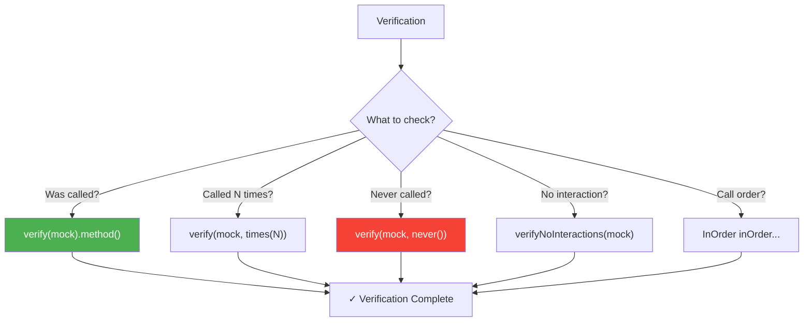

# ✅ Mockito Verification

> **Mawa, mock method call ayyinda check cheyadam = VERIFICATION!**

---

## 🤔 What is Verification?

```
Stubbing = "Ye return chey" (input behavior)
Verification = "Ye call ayyinda check chey" (output behavior)

when(mock.save(any())).thenReturn(user);   // STUB
verify(mock).save(any());                   // VERIFY
```

---

## 📋 Verification Methods

| Method | Purpose |
|--------|---------|
| `verify(mock).method()` | Called exactly once |
| `verify(mock, times(n))` | Called exactly n times |
| `verify(mock, never())` | Never called |
| `verify(mock, atLeast(n))` | At least n times |
| `verify(mock, atMost(n))` | At most n times |
| `verify(mock, atLeastOnce())` | At least once |
| `verifyNoInteractions(mock)` | No method called |
| `verifyNoMoreInteractions(mock)` | No unexpected calls |

---

## 💻 Code Examples

### 1️⃣ Basic Verification

```java
@Test
void verifyMethodCalled() {
    // Act
    userService.register("John", "john@test.com");
    
    // Verify - check if save was called
    verify(repository).save(any(User.class));
    
    // Verify - check if email was sent
    verify(emailService).sendWelcome("john@test.com");
}
```

### 2️⃣ Verify Call Count

```java
@Test
void verifyCallCount() {
    // Act
    userService.processUsers(List.of(user1, user2, user3));
    
    // Called 3 times
    verify(repository, times(3)).save(any());
    
    // Called at least once
    verify(emailService, atLeastOnce()).sendNotification(any());
    
    // Called at most 5 times
    verify(logService, atMost(5)).log(any());
}
```

### 3️⃣ Verify Never Called

```java
@Test
void verifyNeverCalled() {
    // Act - invalid email, should not save
    assertThrows(IllegalArgumentException.class, () -> 
        userService.register("John", "invalid-email"));
    
    // Verify - save should NOT be called
    verify(repository, never()).save(any());
    
    // Verify - email should NOT be sent
    verify(emailService, never()).sendWelcome(any());
}
```

### 4️⃣ Verify No Interactions

```java
@Test
void verifyNoInteractions() {
    // Act - validation fails early
    assertThrows(IllegalArgumentException.class, () -> 
        userService.register(null, null));
    
    // Verify - nothing should be called on mocks
    verifyNoInteractions(repository);
    verifyNoInteractions(emailService);
}
```

### 5️⃣ Verify Order

```java
@Test
void verifyOrder() {
    // Act
    userService.register("John", "john@test.com");
    
    // Verify order: save first, then email
    InOrder inOrder = inOrder(repository, emailService);
    
    inOrder.verify(repository).save(any());  // First
    inOrder.verify(emailService).sendWelcome(any());  // Second
}
```

### 6️⃣ Verify with Timeout

```java
@Test
void verifyWithTimeout() {
    // For async operations
    asyncService.process(data);
    
    // Wait up to 1 second for method to be called
    verify(repository, timeout(1000)).save(any());
    
    // Timeout + times
    verify(eventBus, timeout(2000).times(2)).publish(any());
}
```

---

## 📊 Decision Diagram



---

## 🏢 Enterprise Pattern

```java
@Test
void completeVerification() {
    // Arrange
    User user = new User("John", "john@test.com");
    when(repository.existsByEmail("john@test.com")).thenReturn(false);
    when(repository.save(any())).thenReturn(user);
    
    // Act
    userService.register("John", "john@test.com");
    
    // Verify - ALL expected interactions
    verify(repository).existsByEmail("john@test.com");     // Check duplicate
    verify(repository).save(any(User.class));              // Save user
    verify(emailService).sendWelcome("john@test.com");     // Send email
    
    // Verify - NO unexpected interactions
    verifyNoMoreInteractions(repository);  // Nothing else on repo
}
```

---

## ⚠️ Common Mistakes

### ❌ Mistake: Verifying before act
```java
verify(repository).save(any());  // ❌ Not called yet!
userService.register(...);
```

### ❌ Mistake: Wrong argument in verify
```java
userService.register("John", "john@test.com");

verify(repository).save(new User("John"));  // ❌ Different object!
verify(repository).save(any(User.class));   // ✅ Correct
```

---

## 😂 Memory Trick

```
verify() = "VERIFY kiya ya nahi?"
times(3) = "TIMES 3 baar"
never() = "NEVER called"
atLeast(1) = "AT LEAST ek baar"

Rule:
STUB = "Kya karna hai" (before)
VERIFY = "Kiya kya nahi" (after)
```

---

## 🔗 Related Topics

- [Stubbing](./03-stubbing.md) - when/thenReturn
- [Argument Matchers](./05-argument-matchers.md) - any(), eq()
- [Your Code](file:///d:/Antigravity_Projects/Junit_Mockito_MockMVC/src/test/java/com/learning/mockito/Part3_VerificationTest.java)
