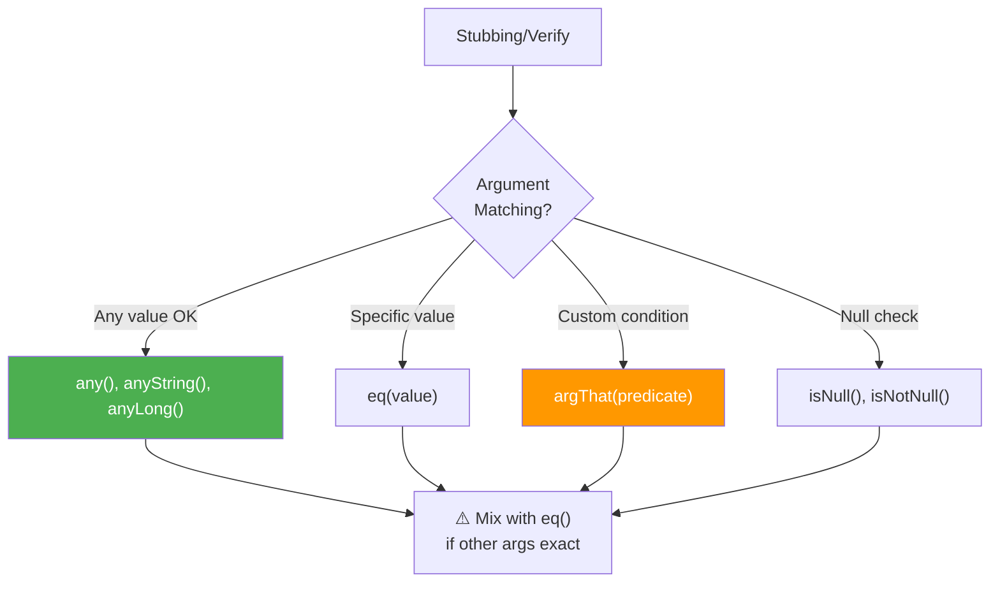

# 🎪 Mockito Argument Matchers

> **Mawa, "any value", "specific value" - flexible matching kavali? Argument Matchers use chey!**

---

## 🤔 What are Argument Matchers?

```java
// Problem: Exact match required
when(repo.findById(1L)).thenReturn(user);
repo.findById(2L);  // Returns null - not matched!

// Solution: Matchers
when(repo.findById(anyLong())).thenReturn(user);
repo.findById(1L);  // Returns user ✓
repo.findById(2L);  // Returns user ✓
repo.findById(999L);  // Returns user ✓
```

---

## 📋 Common Matchers

| Matcher | Purpose | Example |
|---------|---------|---------|
| `any()` | Any object | `any()` |
| `any(Class)` | Any of specific type | `any(User.class)` |
| `anyString()` | Any string | `anyString()` |
| `anyInt()` | Any int | `anyInt()` |
| `anyLong()` | Any long | `anyLong()` |
| `anyList()` | Any list | `anyList()` |
| `eq(value)` | Exact value | `eq("John")` |
| `isNull()` | Null value | `isNull()` |
| `isNotNull()` | Non-null | `isNotNull()` |
| `argThat(predicate)` | Custom match | `argThat(u -> u.isActive())` |
| `contains(str)` | String contains | `contains("test")` |
| `startsWith(str)` | String starts | `startsWith("hello")` |

---

## 💻 Code Examples

### 1️⃣ Basic Matchers

```java
@Test
void basicMatchers() {
    // Any long value
    when(repository.findById(anyLong())).thenReturn(Optional.of(user));
    
    // Any string
    when(repository.findByEmail(anyString())).thenReturn(Optional.of(user));
    
    // Any object of type
    when(repository.save(any(User.class))).thenReturn(user);
    
    // Any list
    when(batchService.process(anyList())).thenReturn(results);
}
```

### 2️⃣ eq() - Exact Value Match

```java
@Test
void exactMatch() {
    // Mix matchers with exact values using eq()
    when(repository.findByNameAndEmail(eq("John"), anyString()))
        .thenReturn(Optional.of(user));
    
    // ✅ Works
    repository.findByNameAndEmail("John", "any@email.com");
    
    // ❌ Doesn't match - name is different
    repository.findByNameAndEmail("Jane", "any@email.com");
}
```

### 3️⃣ argThat() - Custom Matcher

```java
@Test
void customMatcher() {
    // Match users with specific condition
    when(repository.save(argThat(user -> 
        user.getName().length() > 3 && user.isActive())))
        .thenReturn(savedUser);
    
    // Match emails with domain
    when(emailService.send(argThat(email -> 
        email.endsWith("@company.com"))))
        .thenReturn(true);
    
    // Match lists with size
    when(batchRepo.saveAll(argThat(list -> list.size() <= 100)))
        .thenReturn(savedList);
}
```

### 4️⃣ Null Matchers

```java
@Test
void nullMatchers() {
    // Match null
    when(repository.findByEmail(isNull())).thenReturn(Optional.empty());
    
    // Match non-null
    when(repository.findByEmail(isNotNull())).thenReturn(Optional.of(user));
    
    // Nullable - null or non-null
    when(service.process(nullable(String.class))).thenReturn(result);
}
```

---

## ⚠️ Critical Rule: All or Nothing!

```java
// ❌ WRONG: Mixing matchers and raw values
when(repository.findByNameAndStatus("John", any()))  // Error!
    .thenReturn(user);

// ✅ CORRECT: Use eq() for exact values
when(repository.findByNameAndStatus(eq("John"), any()))
    .thenReturn(user);

// ✅ CORRECT: All raw values (no matchers)
when(repository.findByNameAndStatus("John", Status.ACTIVE))
    .thenReturn(user);
```

**Rule: If you use ONE matcher, you must use matchers for ALL arguments!**

---

## 📊 Decision Diagram



---

## 🏢 Enterprise Pattern

```java
@Test
void complexVerification() {
    // Act
    orderService.placeOrder(customer, items, address);
    
    // Verify with complex matching
    verify(paymentService).charge(
        argThat(payment -> 
            payment.getAmount() > 0 && 
            payment.getCurrency().equals("USD")),
        eq(customer.getId())
    );
    
    verify(inventoryService).reserve(
        argThat(list -> list.size() == items.size()),
        anyString()
    );
    
    verify(notificationService).send(
        argThat(msg -> msg.contains("Order confirmed")),
        eq(customer.getEmail())
    );
}
```

---

## 😂 Memory Trick

```
any() = "ANY value chalega!"
eq() = "EXACT ye value hi"
argThat() = "ARG THis mATches?"

Rule: "Ek matcher, sab matcher!"
- One matcher use kiya? 
- Sab arguments pe matcher lagao!
- Raw values ke liye eq() use karo
```

---

## 🔗 Related Topics

- [Stubbing](./03-stubbing.md) - when/thenReturn
- [Verification](./04-verification.md) - verify()
- [Argument Captor](./07-argument-captor.md) - Capture values
- [Your Code](file:///d:/Antigravity_Projects/Junit_Mockito_MockMVC/src/test/java/com/learning/mockito/Part4_ArgumentMatchersTest.java)
