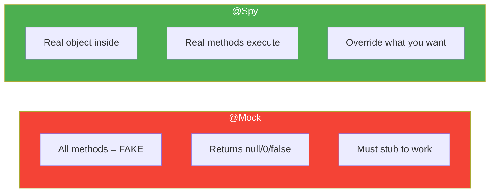

# 🕵️ Spy vs Mock

> **Mawa, Mock = Full fake, Spy = Real object with spy capability!**

---

## 🤔 Mock vs Spy - Difference

```
MOCK:
- Completely fake object
- All methods return defaults (null, 0, false)
- You MUST stub every method you use

SPY:
- Real object wrapped with spy capability
- Real methods execute by default
- You CAN override specific methods
```

---

## 📊 Visual Comparison



---

## 💻 Code Examples

### 1️⃣ Basic Spy

```java
@Spy
private List<String> spyList = new ArrayList<>();

@Test
void spyBasic() {
    // Real method executes!
    spyList.add("one");
    spyList.add("two");
    
    assertEquals(2, spyList.size());  // Real size!
    assertTrue(spyList.contains("one"));  // Real contains!
    
    // Override specific method
    doReturn(100).when(spyList).size();
    assertEquals(100, spyList.size());  // Now stubbed!
    
    // But other methods still real
    assertTrue(spyList.contains("one"));  // Still real!
}
```

### 2️⃣ Spy on Real Service

```java
@Spy
private UserValidator validator = new UserValidator();

@InjectMocks
private UserService userService;

@Test
void spyOnValidator() {
    // Real validation runs
    User validUser = new User("John", "john@test.com");
    assertTrue(validator.isValid(validUser));  // Real logic!
    
    // Override for specific scenario
    User specialUser = new User("Admin", "admin@test.com");
    doReturn(true).when(validator).isValid(specialUser);  // Always valid
    
    // Use in service
    userService.register(validUser);  // Real validation
}
```

### 3️⃣ Partial Mocking with Spy

```java
@Spy
private PaymentProcessor processor = new PaymentProcessor();

@Test
void partialMock() {
    // Real method for calculation
    BigDecimal amount = processor.calculateTotal(items);  // Real!
    
    // Mock external call
    doReturn(true).when(processor).chargeCard(any(), any());  // Fake!
    
    // Now test uses real calculation + fake charging
    boolean result = processor.process(items, card);
    assertTrue(result);
}
```

---

## ⚠️ Important: Stubbing Spy

```java
// ❌ WRONG for Spy - calls real method!
when(spyList.get(0)).thenReturn("one");  // Actually calls get(0)!

// ✅ CORRECT for Spy - use doReturn
doReturn("one").when(spyList).get(0);  // Doesn't call real method
```

**Rule: With @Spy, use `doReturn().when()` instead of `when().thenReturn()`!**

---

## 🎯 When to Use What?

| Scenario | Use |
|----------|-----|
| External dependency (DB, API) | `@Mock` |
| Test isolation | `@Mock` |
| Real logic needed + some override | `@Spy` |
| Legacy code partial testing | `@Spy` |
| Testing the class under test | `@Spy` (rare) |

---

## 🏢 Enterprise Pattern

```java
@Spy
private CacheService cacheService = new CacheService();

@Mock
private DatabaseService databaseService;

@InjectMocks
private ProductService productService;

@Test
void testWithCacheHit() {
    Product product = new Product("iPhone");
    
    // Real cache + mock DB
    cacheService.put("iphone", product);  // Real cache stores
    
    Product result = productService.findByName("iphone");
    
    // Should hit cache, NOT call DB
    verify(databaseService, never()).findByName(any());
    assertEquals("iPhone", result.getName());
}

@Test
void testWithCacheMiss() {
    // Spy cache returns null (miss)
    doReturn(null).when(cacheService).get("galaxy");
    
    // DB should be called
    when(databaseService.findByName("galaxy")).thenReturn(new Product("Galaxy"));
    
    productService.findByName("galaxy");
    
    verify(databaseService).findByName("galaxy");  // DB was called
}
```

---

## 😂 Memory Trick

```
MOCK = "MOCK banana - full nakli!" 🍌
SPY = "SPY lagao - real pe nazar!" 🕵️

Mock = Fake stunt double (can't do anything real)
Spy = Real actor with hidden camera (doing real work)

doReturn().when(spy) = "SPY ke liye - pehle result bolo!"
when(mock).thenReturn() = "MOCK ke liye - ye bhi chalega!"
```

---

## 🔗 Related Topics

- [Mock Basics](./02-mock-basics.md) - @Mock
- [Argument Captor](./07-argument-captor.md) - Capture values
- [Your Code](file:///d:/Antigravity_Projects/Junit_Mockito_MockMVC/src/test/java/com/learning/mockito/Part5_SpyTest.java)
