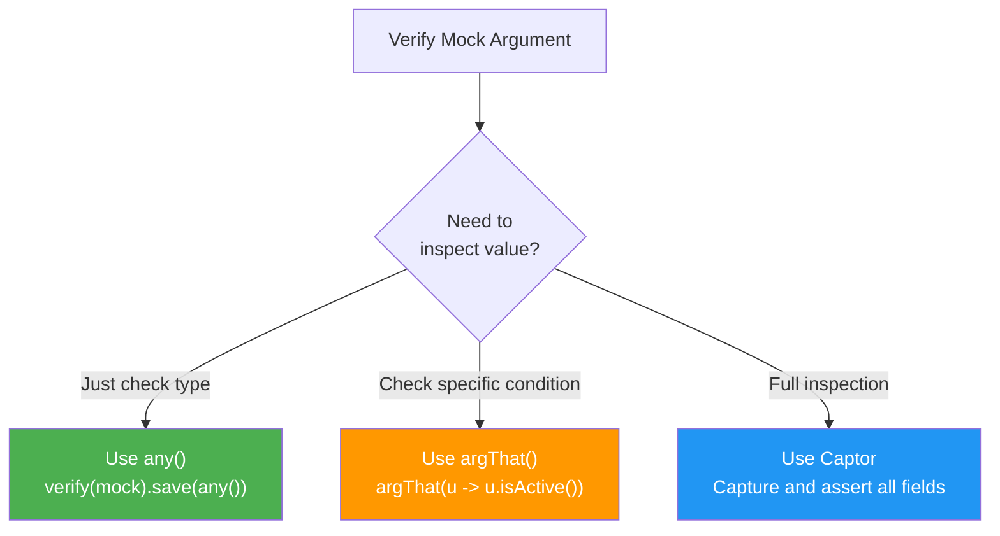

# 📥 Mockito Argument Captor

> **Mawa, mock ki pass chesina argument ni capture chesi inspect cheyyali? ArgumentCaptor use chey!**

---

## 🤔 What is Argument Captor?

```java
// Problem: What was actually passed to mock?
userService.register("John", "john@test.com");
verify(repository).save(any(User.class));  // OK, but WHAT was saved?

// Solution: Capture the argument!
ArgumentCaptor<User> captor = ArgumentCaptor.forClass(User.class);
verify(repository).save(captor.capture());
User savedUser = captor.getValue();  // Now inspect it!
```

---

## 💻 Code Examples

### 1️⃣ Basic Capture

```java
@Captor
private ArgumentCaptor<User> userCaptor;

@Test
void captureArgument() {
    // Act
    userService.register("John", "john@test.com");
    
    // Capture
    verify(repository).save(userCaptor.capture());
    
    // Inspect
    User captured = userCaptor.getValue();
    assertEquals("John", captured.getName());
    assertEquals("john@test.com", captured.getEmail());
    assertTrue(captured.isActive());  // Default should be true
    assertNotNull(captured.getCreatedAt());
}
```

### 2️⃣ Capture Multiple Calls

```java
@Test
void captureMultiple() {
    // Act - multiple saves
    userService.registerBatch(List.of(
        new UserDTO("John", "john@test.com"),
        new UserDTO("Jane", "jane@test.com"),
        new UserDTO("Bob", "bob@test.com")
    ));
    
    // Capture all
    verify(repository, times(3)).save(userCaptor.capture());
    
    // Get all captured values
    List<User> allCaptured = userCaptor.getAllValues();
    
    assertEquals(3, allCaptured.size());
    assertEquals("John", allCaptured.get(0).getName());
    assertEquals("Jane", allCaptured.get(1).getName());
    assertEquals("Bob", allCaptured.get(2).getName());
}
```

### 3️⃣ Capture Complex Objects

```java
@Captor
private ArgumentCaptor<EmailMessage> emailCaptor;

@Test
void captureEmail() {
    userService.register("John", "john@test.com");
    
    verify(emailService).send(emailCaptor.capture());
    
    EmailMessage email = emailCaptor.getValue();
    
    assertAll("Email content",
        () -> assertEquals("john@test.com", email.getTo()),
        () -> assertEquals("Welcome!", email.getSubject()),
        () -> assertTrue(email.getBody().contains("John")),
        () -> assertFalse(email.getAttachments().isEmpty())
    );
}
```

### 4️⃣ Inline Captor (Without Annotation)

```java
@Test
void inlineCaptor() {
    userService.register("John", "john@test.com");
    
    // Create inline
    ArgumentCaptor<User> captor = ArgumentCaptor.forClass(User.class);
    
    verify(repository).save(captor.capture());
    
    assertEquals("John", captor.getValue().getName());
}
```

---

## 📊 When to Use Captor vs Matcher



| Approach | Use When |
|----------|----------|
| `any()` | Just checking if method was called |
| `argThat()` | Simple condition check |
| `ArgumentCaptor` | Complex object inspection |

---

## 🏢 Enterprise Pattern

```java
@Captor ArgumentCaptor<AuditLog> auditCaptor;

@Test
void verifyAuditLog() {
    // Act
    userService.updateUser(1L, new UserUpdateDTO("New Name"));
    
    // Capture audit log
    verify(auditService).log(auditCaptor.capture());
    
    AuditLog log = auditCaptor.getValue();
    
    assertAll("Audit log verification",
        () -> assertEquals("UPDATE", log.getAction()),
        () -> assertEquals("User", log.getEntityType()),
        () -> assertEquals("1", log.getEntityId()),
        () -> assertEquals("admin", log.getPerformedBy()),
        () -> assertNotNull(log.getTimestamp()),
        () -> assertTrue(log.getChanges().containsKey("name"))
    );
}
```

---

## ⚠️ Common Mistake

```java
// ❌ WRONG: capture() in stubbing
when(repository.save(userCaptor.capture())).thenReturn(user);  // Don't do this!

// ✅ CORRECT: capture() only in verify
when(repository.save(any())).thenReturn(user);  // Stub
verify(repository).save(userCaptor.capture());  // Capture in verify
```

---

## 😂 Memory Trick

```
ArgumentCaptor = "CAPTURE the ARGUMENT!" 📸

Like a spy camera:
- Mock method gets called
- Captor takes photo of argument
- You develop the photo and inspect it

getValue() = "GET last VALUE captured"
getAllValues() = "GET ALL VALUES captured"
```

---

## 🔗 Related Topics

- [Argument Matchers](./05-argument-matchers.md) - any(), argThat()
- [Verification](./04-verification.md) - verify()
- [Your Code](file:///d:/Antigravity_Projects/Junit_Mockito_MockMVC/src/test/java/com/learning/mockito/Part6_ArgumentCaptorTest.java)
