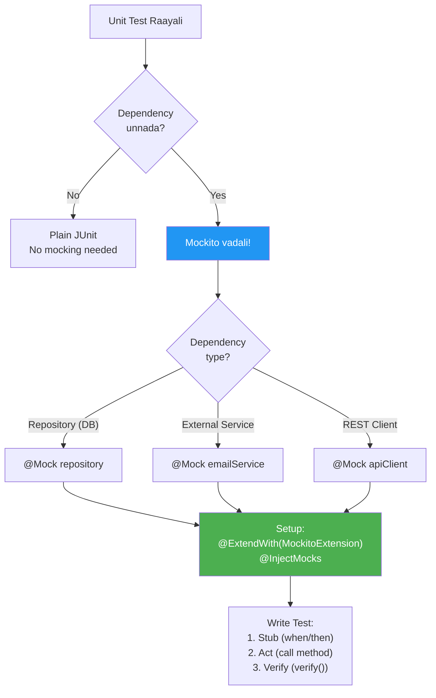

# 🔵 Mockito Complete Guide

> **Mawa, Mocking concept brush-up to advanced - full coverage!**
> **Why Mocking? How to Mock? When to Mock? - Anni ikkada unnay!**

---

## 📚 Topics Index

| # | Topic | File | Quick Link |
|---|-------|------|------------|
| 1 | 🤔 **Why Mocking?** | [01-why-mocking.md](./01-why-mocking.md) | Concept, Purpose, Benefits |
| 2 | 🎭 **Mock Basics** | [02-mock-basics.md](./02-mock-basics.md) | @Mock, @InjectMocks, @ExtendWith |
| 3 | 🎯 **Stubbing** | [03-stubbing.md](./03-stubbing.md) | when/thenReturn, thenThrow |
| 4 | ✅ **Verification** | [04-verification.md](./04-verification.md) | verify(), times(), never() |
| 5 | 🎪 **Argument Matchers** | [05-argument-matchers.md](./05-argument-matchers.md) | any(), eq(), argThat() |
| 6 | 🕵️ **Spy vs Mock** | [06-spy-vs-mock.md](./06-spy-vs-mock.md) | @Spy, partial mocking |
| 7 | 📥 **Argument Captor** | [07-argument-captor.md](./07-argument-captor.md) | Capture and inspect |
| 8 | 📖 **BDD Style** | [08-bdd-style.md](./08-bdd-style.md) | given/when/then |

---

## 🤔 Decision Flowchart



---

## 🔗 Your Test Files

| Topic | Test File |
|-------|-----------|
| Mock Basics | [Part1_MockBasicsTest.java](file:///d:/Antigravity_Projects/Junit_Mockito_MockMVC/src/test/java/com/learning/mockito/Part1_MockBasicsTest.java) |
| Stubbing | [Part2_StubbingTest.java](file:///d:/Antigravity_Projects/Junit_Mockito_MockMVC/src/test/java/com/learning/mockito/Part2_StubbingTest.java) |
| Verification | [Part3_VerificationTest.java](file:///d:/Antigravity_Projects/Junit_Mockito_MockMVC/src/test/java/com/learning/mockito/Part3_VerificationTest.java) |
| Argument Matchers | [Part4_ArgumentMatchersTest.java](file:///d:/Antigravity_Projects/Junit_Mockito_MockMVC/src/test/java/com/learning/mockito/Part4_ArgumentMatchersTest.java) |
| Spy | [Part5_SpyTest.java](file:///d:/Antigravity_Projects/Junit_Mockito_MockMVC/src/test/java/com/learning/mockito/Part5_SpyTest.java) |
| Argument Captor | [Part6_ArgumentCaptorTest.java](file:///d:/Antigravity_Projects/Junit_Mockito_MockMVC/src/test/java/com/learning/mockito/Part6_ArgumentCaptorTest.java) |
| BDD Style | [Part7_BDDStyleTest.java](file:///d:/Antigravity_Projects/Junit_Mockito_MockMVC/src/test/java/com/learning/mockito/Part7_BDDStyleTest.java) |
| Enterprise | [Part8_EnterpriseScenariosTest.java](file:///d:/Antigravity_Projects/Junit_Mockito_MockMVC/src/test/java/com/learning/mockito/Part8_EnterpriseScenariosTest.java) |
| Real World | [Part9_RealWorldUserServiceTest.java](file:///d:/Antigravity_Projects/Junit_Mockito_MockMVC/src/test/java/com/learning/mockito/Part9_RealWorldUserServiceTest.java) |

---

## 🎯 One-Minute Summary

```java
@ExtendWith(MockitoExtension.class)  // 1. Enable Mockito
class MyTest {
    
    @Mock                             // 2. Create fake dependency
    private Repository repo;
    
    @InjectMocks                      // 3. Inject mocks into SUT
    private Service service;
    
    @Test
    void test() {
        // 4. STUB: Define behavior
        when(repo.findById(1L)).thenReturn(Optional.of(user));
        
        // 5. ACT: Call method
        User result = service.getUser(1L);
        
        // 6. VERIFY: Check interactions
        verify(repo).findById(1L);
    }
}
```

---

## 🏃 Quick Commands

```powershell
# Run all Mockito tests
.\mvnw.cmd test -Dtest="Part*Test" -pl junit-learning

# Run specific part
.\mvnw.cmd test -Dtest=Part1_MockBasicsTest
```
