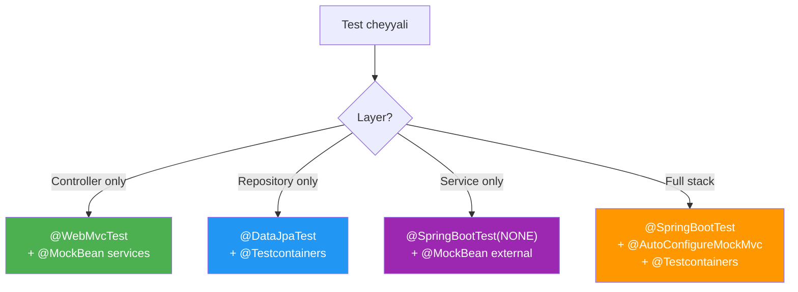

# 🎯 Spring Boot Testing Annotations

> **Mawa, Spring testing lo anni annotations - when/how/why explained!**

---

## 📋 Annotations Quick Reference

| Annotation | Purpose | Loads |
|------------|---------|-------|
| `@SpringBootTest` | Full integration test | Everything |
| `@WebMvcTest` | Controller layer only | Web layer |
| `@DataJpaTest` | Repository layer only | JPA layer |
| `@MockBean` | Mock bean in Spring context | - |
| `@AutoConfigureMockMvc` | Enable MockMvc | MockMvc |
| `@Testcontainers` | Docker container support | - |

---

## 🎯 @SpringBootTest

### What it does:
- Loads COMPLETE Spring application context
- All beans, configurations, properties

### Options:

```java
// Default - Mock web environment
@SpringBootTest
class Test1 { }

// No web environment - fastest
@SpringBootTest(webEnvironment = WebEnvironment.NONE)
class Test2 { }

// Mock web (same as default)
@SpringBootTest(webEnvironment = WebEnvironment.MOCK)
class Test3 { }

// Real server on random port
@SpringBootTest(webEnvironment = WebEnvironment.RANDOM_PORT)
class Test4 { }

// Real server on fixed port
@SpringBootTest(webEnvironment = WebEnvironment.DEFINED_PORT)
class Test5 { }
```

### When to Use:

| WebEnvironment | Use When |
|----------------|----------|
| `NONE` | Service layer test, no HTTP |
| `MOCK` | MockMvc testing |
| `RANDOM_PORT` | Real HTTP testing with TestRestTemplate |

### Positives:
- ✅ Full application context
- ✅ Real beans and configurations
- ✅ Production-like testing

### Negatives:
- ❌ Slow (full context load)
- ❌ Heavy (more memory)

---

## 🌐 @WebMvcTest

### What it does:
- Loads ONLY web layer
- Controller, Filters, ControllerAdvice
- Does NOT load Service, Repository

```java
@WebMvcTest(UserController.class)
class UserControllerTest {
    
    @Autowired
    MockMvc mockMvc;  // Available!
    
    @MockBean
    UserService userService;  // Must mock - not loaded!
    
    @Test
    void test() throws Exception {
        when(userService.find(1L)).thenReturn(user);
        
        mockMvc.perform(get("/api/users/1"))
            .andExpect(status().isOk());
    }
}
```

### Positives:
- ✅ Fast - minimal beans
- ✅ Focused on controller logic
- ✅ No DB needed

### Negatives:
- ❌ Must mock all dependencies
- ❌ Not real integration test

---

## 💾 @DataJpaTest

### What it does:
- Loads ONLY JPA layer
- Entities, Repositories, EntityManager
- Uses H2 by default (in-memory)

```java
@DataJpaTest
class UserRepositoryTest {
    
    @Autowired
    UserRepository repository;  // Available!
    
    @Autowired
    TestEntityManager em;  // For test data setup
    
    @Test
    void testFindByEmail() {
        em.persist(new User("John", "john@test.com"));
        
        Optional<User> found = repository.findByEmail("john@test.com");
        assertTrue(found.isPresent());
    }
}
```

### For Real Database:

```java
@DataJpaTest
@AutoConfigureTestDatabase(replace = Replace.NONE)  // Don't use H2!
@Testcontainers
class UserRepositoryTest {
    // Uses your configured datasource (Testcontainers)
}
```

### Positives:
- ✅ Fast - only JPA layer
- ✅ @Transactional by default (auto-rollback)
- ✅ Good for custom query testing

### Negatives:
- ❌ H2 ≠ Production DB (subtle differences)
- ❌ Need Replace.NONE for real DB

---

## 🎭 @MockBean

### What it does:
- Creates mock AND registers in Spring context
- Replaces real bean with mock

```java
@SpringBootTest
class MyTest {
    
    @Autowired
    UserService userService;  // REAL
    
    @MockBean
    EmailService emailService;  // MOCK - replaces real bean!
}
```

### @Mock vs @MockBean:

| @Mock | @MockBean |
|-------|-----------|
| Mockito only | Spring + Mockito |
| Unit tests | Integration tests |
| Manual injection | Auto-injected everywhere |
| No context | Replaces in context |

### When to Use:
- ✅ External services (Email, SMS)
- ✅ Third-party APIs
- ✅ Anything you don't want to call for real

---

## 🔧 @AutoConfigureMockMvc

### What it does:
- Configures MockMvc bean
- Use with @SpringBootTest

```java
@SpringBootTest
@AutoConfigureMockMvc
class Test {
    
    @Autowired
    MockMvc mockMvc;  // Now available!
}
```

---

## 📊 Decision Matrix



---

## 😂 Memory Trick

```
@SpringBootTest = "SPRING BOOT sab load karo!"
@WebMvcTest = "WEB MVC = Controller only!"
@DataJpaTest = "DATA JPA = Repository only!"
@MockBean = "MOCK as BEAN in Spring!"

Full Test = @SpringBootTest + @AutoConfigureMockMvc + @Testcontainers
Fast Test = @WebMvcTest or @DataJpaTest
```

---

## 🔗 Related Topics

- [MockMvc](./02-mockmvc.md) - HTTP testing
- [Slice Tests](./03-slice-tests.md) - Layer testing
- [Testcontainers](./04-testcontainers.md) - Real DB
