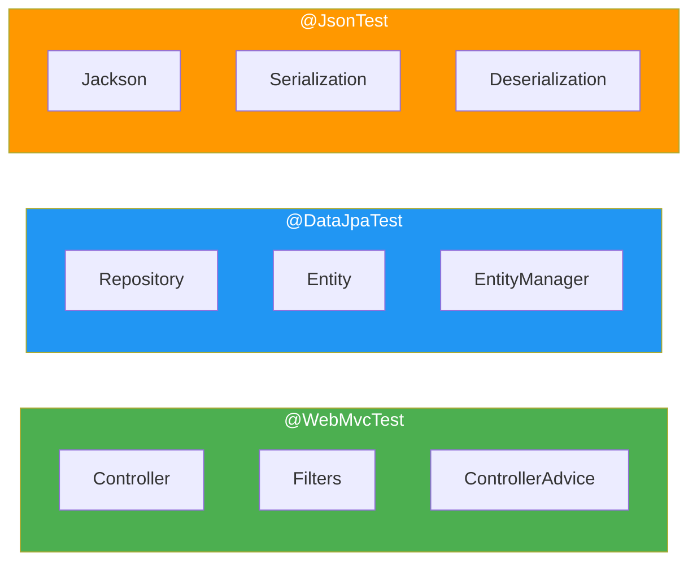

# ✂️ Spring Boot Slice Tests

> **Mawa, full application load cheyakunda specific layer test cheyyali? Slice tests use chey!**

---

## 🤔 What are Slice Tests?

```
Full Test:        Controller + Service + Repository + DB
Slice Test:       Only ONE layer at a time!

@WebMvcTest  →    Controller only
@DataJpaTest →    Repository only
@JsonTest    →    JSON serialization only
```

**Benefit: FAST! Only load what you need!**

---

## 📊 Slice Test Types



---

## 🌐 @WebMvcTest - Controller Layer

```java
@WebMvcTest(UserController.class)
class UserControllerTest {
    
    @Autowired
    MockMvc mockMvc;
    
    @MockBean
    UserService userService;  // Must mock!
    
    @Test
    void shouldGetUser() throws Exception {
        // Stub service
        when(userService.findById(1L)).thenReturn(Optional.of(user));
        
        // Test controller
        mockMvc.perform(get("/api/users/1"))
            .andExpect(status().isOk())
            .andExpect(jsonPath("$.name").value("John"));
    }
    
    @Test
    void shouldValidateInput() throws Exception {
        // No stub needed - testing validation!
        mockMvc.perform(post("/api/users")
                .contentType(MediaType.APPLICATION_JSON)
                .content("""{"name": "", "email": "invalid"}"""))
            .andExpect(status().isBadRequest());
    }
}
```

### What's Loaded:
- ✅ Controller, Filters, ControllerAdvice
- ❌ Service, Repository, DB

### When to Use:
- Controller routing correct?
- Validation working?
- HTTP status codes correct?
- JSON format correct?

---

## 💾 @DataJpaTest - Repository Layer

```java
@DataJpaTest
class UserRepositoryTest {
    
    @Autowired
    UserRepository repository;
    
    @Autowired
    TestEntityManager entityManager;
    
    @Test
    void shouldFindByEmail() {
        // Setup
        User user = new User("John", "john@test.com", "pass");
        entityManager.persist(user);
        entityManager.flush();
        
        // Test
        Optional<User> found = repository.findByEmail("john@test.com");
        
        // Assert
        assertTrue(found.isPresent());
        assertEquals("John", found.get().getName());
    }
    
    @Test
    void shouldCheckEmailExists() {
        entityManager.persist(new User("Jane", "jane@test.com", "pass"));
        entityManager.flush();
        
        assertTrue(repository.existsByEmail("jane@test.com"));
        assertFalse(repository.existsByEmail("unknown@test.com"));
    }
}
```

### What's Loaded:
- ✅ Repository, Entity, JPA config
- ❌ Controller, Service, Web layer

### Features:
- `@Transactional` by default (auto-rollback)
- Uses H2 in-memory (override with `Replace.NONE`)

### For Real DB:

```java
@DataJpaTest
@AutoConfigureTestDatabase(replace = Replace.NONE)
@Testcontainers
class UserRepositoryTest {
    
    @Container
    static MySQLContainer<?> mysql = new MySQLContainer<>("mysql:8.0");
    
    @DynamicPropertySource
    static void setDataSource(DynamicPropertyRegistry registry) {
        registry.add("spring.datasource.url", mysql::getJdbcUrl);
        registry.add("spring.datasource.username", mysql::getUsername);
        registry.add("spring.datasource.password", mysql::getPassword);
    }
}
```

---

## 📝 @JsonTest - Serialization

```java
@JsonTest
class UserJsonTest {
    
    @Autowired
    JacksonTester<User> json;
    
    @Test
    void shouldSerialize() throws Exception {
        User user = new User("John", "john@test.com");
        user.setId(1L);
        
        JsonContent<User> result = json.write(user);
        
        assertThat(result).extractingJsonPathStringValue("$.name")
            .isEqualTo("John");
        assertThat(result).extractingJsonPathStringValue("$.email")
            .isEqualTo("john@test.com");
    }
    
    @Test
    void shouldDeserialize() throws Exception {
        String content = """
            {"id": 1, "name": "John", "email": "john@test.com"}
            """;
        
        User user = json.parse(content).getObject();
        
        assertEquals("John", user.getName());
        assertEquals("john@test.com", user.getEmail());
    }
}
```

### When to Use:
- Custom serializers
- Date format checking
- Field naming strategy

---

## 📊 Comparison

| Annotation | Loads | Speed | Use Case |
|------------|-------|-------|----------|
| `@WebMvcTest` | Web layer | ⚡ Fast | Controller tests |
| `@DataJpaTest` | JPA layer | ⚡ Fast | Repository tests |
| `@JsonTest` | Jackson | ⚡⚡ Fastest | Serialization |
| `@SpringBootTest` | Everything | 🐢 Slow | Integration |

---

## 🏢 Best Practice: Layer Testing

```java
// 1. Controller Layer - @WebMvcTest
@WebMvcTest(UserController.class)
class UserControllerTest {
    @MockBean UserService service;
    // Test HTTP, validation, routing
}

// 2. Service Layer - Mockito (no slice)
@ExtendWith(MockitoExtension.class)
class UserServiceTest {
    @Mock UserRepository repository;
    @InjectMocks UserService service;
    // Test business logic
}

// 3. Repository Layer - @DataJpaTest
@DataJpaTest
class UserRepositoryTest {
    @Autowired UserRepository repository;
    // Test queries
}

// 4. Full Integration - @SpringBootTest
@SpringBootTest
@Testcontainers
class UserIntegrationTest {
    // Test everything together
}
```

---

## 😂 Memory Trick

```
@WebMvcTest = "WEB test - Controller!"
@DataJpaTest = "DATA test - Repository!"
@JsonTest = "JSON test - Jackson!"

Slice = "SLICE of pizza, not whole pizza!"
Only one layer at a time!
```

---

## 🔗 Related Topics

- [Annotations](./01-annotations.md) - All annotations
- [MockMvc](./02-mockmvc.md) - HTTP testing
- [Testcontainers](./04-testcontainers.md) - Real DB
