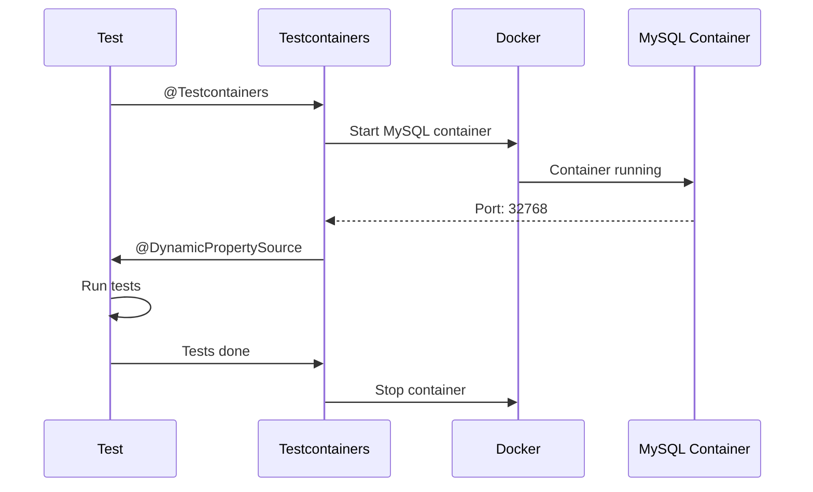

# 🐳 Testcontainers Guide

> **Mawa, real database test cheyyali? Testcontainers use chey - Docker lo real DB!**

---

## 🤔 What is Testcontainers?

```
H2 (embedded)     vs      Testcontainers
━━━━━━━━━━━━━             ━━━━━━━━━━━━━━
In-memory, fast           Real DB in Docker
"Fake" MySQL              REAL MySQL 8.0
Subtle differences        Production-like!
```

**Testcontainers = Run real databases/services in Docker for tests!**

---

## 📋 Setup

### Maven Dependencies:

```xml
<dependency>
    <groupId>org.testcontainers</groupId>
    <artifactId>testcontainers</artifactId>
    <scope>test</scope>
</dependency>
<dependency>
    <groupId>org.testcontainers</groupId>
    <artifactId>mysql</artifactId>
    <scope>test</scope>
</dependency>
<dependency>
    <groupId>org.testcontainers</groupId>
    <artifactId>junit-jupiter</artifactId>
    <scope>test</scope>
</dependency>
```

---

## 💻 Basic Setup

```java
@SpringBootTest
@Testcontainers
class IntegrationTest {
    
    @Container
    static MySQLContainer<?> mysql = new MySQLContainer<>("mysql:8.0")
        .withDatabaseName("testdb")
        .withUsername("test")
        .withPassword("test");
    
    @DynamicPropertySource
    static void setProperties(DynamicPropertyRegistry registry) {
        registry.add("spring.datasource.url", mysql::getJdbcUrl);
        registry.add("spring.datasource.username", mysql::getUsername);
        registry.add("spring.datasource.password", mysql::getPassword);
    }
    
    @Test
    void test() {
        // Uses REAL MySQL in Docker!
    }
}
```

---

## 📊 How It Works



---

## 🏢 Reusable Base Class (Best Practice)

```java
// AbstractContainerBaseTest.java
@Testcontainers
public abstract class AbstractContainerBaseTest {
    
    @Container
    static MySQLContainer<?> mysql = new MySQLContainer<>("mysql:8.0")
        .withDatabaseName("testdb")
        .withUsername("test")
        .withPassword("test");
    
    @DynamicPropertySource
    static void configureProperties(DynamicPropertyRegistry registry) {
        registry.add("spring.datasource.url", mysql::getJdbcUrl);
        registry.add("spring.datasource.username", mysql::getUsername);
        registry.add("spring.datasource.password", mysql::getPassword);
        registry.add("spring.jpa.hibernate.ddl-auto", () -> "create-drop");
    }
}

// AbstractIntegrationTest.java
@SpringBootTest(webEnvironment = WebEnvironment.RANDOM_PORT)
public abstract class AbstractIntegrationTest extends AbstractContainerBaseTest {
    // Full Spring context + Testcontainers
}

// Usage - Super clean!
class UserIntegrationTest extends AbstractIntegrationTest {
    @Test
    void test() { /* Real MySQL! */ }
}
```

---

## 🎯 Available Containers

| Container | Use Case |
|-----------|----------|
| `MySQLContainer` | MySQL database |
| `PostgreSQLContainer` | PostgreSQL |
| `MongoDBContainer` | MongoDB |
| `KafkaContainer` | Kafka messaging |
| `RedisContainer` | Redis cache |
| `LocalStackContainer` | AWS services |
| `GenericContainer` | Any Docker image |

---

## 💻 Multiple Containers

```java
@Testcontainers
class MultiContainerTest {
    
    @Container
    static MySQLContainer<?> mysql = new MySQLContainer<>("mysql:8.0");
    
    @Container
    static GenericContainer<?> redis = new GenericContainer<>("redis:7")
        .withExposedPorts(6379);
    
    @DynamicPropertySource
    static void setProperties(DynamicPropertyRegistry registry) {
        // MySQL
        registry.add("spring.datasource.url", mysql::getJdbcUrl);
        
        // Redis
        registry.add("spring.redis.host", redis::getHost);
        registry.add("spring.redis.port", redis::getFirstMappedPort);
    }
}
```

---

## ⚠️ @AutoConfigureTestDatabase

```java
// ❌ WRONG: @DataJpaTest uses H2 by default!
@DataJpaTest
class RepositoryTest {
    // Uses H2, not your Testcontainer!
}

// ✅ CORRECT: Disable replacement
@DataJpaTest
@AutoConfigureTestDatabase(replace = Replace.NONE)
class RepositoryTest extends AbstractContainerBaseTest {
    // Now uses your MySQL Testcontainer!
}
```

---

## 🎯 When to Use

| Scenario | Use |
|----------|-----|
| Quick unit tests | H2 (fast) |
| DB-specific features | Testcontainers |
| Production-like tests | Testcontainers |
| CI/CD pipeline | Testcontainers |

---

## 😂 Memory Trick

```
@Testcontainers = "TEST with Docker CONTAINERS!"
@Container = "This field IS a CONTAINER"
@DynamicPropertySource = "DYNAMIC props from running container"

Replace.NONE = "NONE replace - use MY DB!"
Replace.ANY = "ANY DB replace with H2!"
```

---

## 🔗 Related Topics

- [Annotations](./01-annotations.md) - @SpringBootTest
- [FAQ](../faq/03-replace-options.md) - Replace.ANY vs Replace.NONE
- [Your Code](file:///d:/Antigravity_Projects/Junit_Mockito_MockMVC/src/test/java/com/learning/integration/AbstractIntegrationTest.java)
