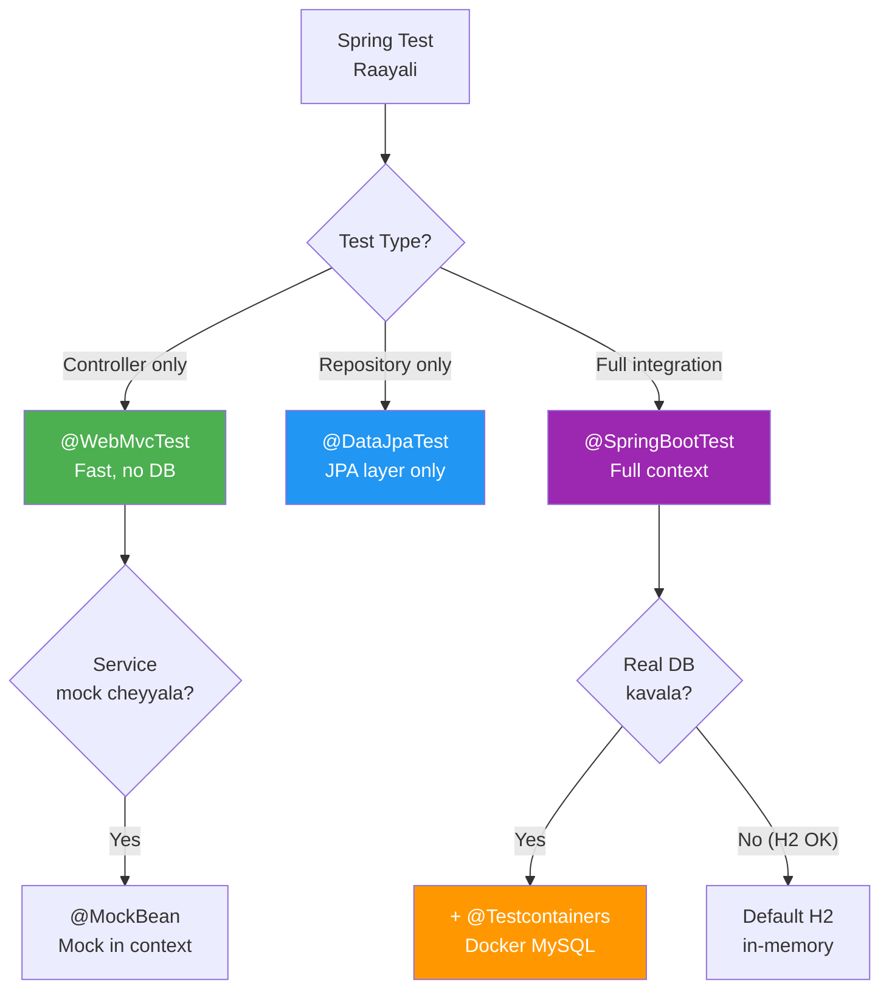

# 🟣 Spring Boot Testing Complete Guide

> **Mawa, Spring Boot lo testing - @SpringBootTest to Testcontainers, all covered!**
> **Unit to Integration to E2E - Complete Journey!**

---

## 📚 Topics Index

| # | Topic | File | Quick Link |
|---|-------|------|------------|
| 1 | 🎯 **Testing Annotations** | [01-annotations.md](./01-annotations.md) | @SpringBootTest, @WebMvcTest, @DataJpaTest |
| 2 | 🌐 **MockMvc** | [02-mockmvc.md](./02-mockmvc.md) | HTTP testing, Request/Response |
| 3 | ✂️ **Slice Tests** | [03-slice-tests.md](./03-slice-tests.md) | Web, Data, JSON slices |
| 4 | 🐳 **Testcontainers** | [04-testcontainers.md](./04-testcontainers.md) | Real DB in Docker |
| 5 | 🏢 **Enterprise Patterns** | [05-enterprise-patterns.md](./05-enterprise-patterns.md) | CI/CD, Best practices |

---

## 🤔 Decision Flowchart



---

## 🔗 Your Test Files

| Topic | Test File |
|-------|-----------|
| Full Integration | [UserControllerIntegrationTest.java](file:///d:/Antigravity_Projects/Junit_Mockito_MockMVC/src/test/java/com/learning/integration/UserControllerIntegrationTest.java) |
| Service Integration | [UserServiceIntegrationTest.java](file:///d:/Antigravity_Projects/Junit_Mockito_MockMVC/src/test/java/com/learning/integration/UserServiceIntegrationTest.java) |
| Web Layer | [UserControllerWebLayerTest.java](file:///d:/Antigravity_Projects/Junit_Mockito_MockMVC/src/test/java/com/learning/controller/UserControllerWebLayerTest.java) |
| Repository | [UserRepositoryTest.java](file:///d:/Antigravity_Projects/Junit_Mockito_MockMVC/src/test/java/com/learning/repository/UserRepositoryTest.java) |
| Service Unit | [UserServiceTest.java](file:///d:/Antigravity_Projects/Junit_Mockito_MockMVC/src/test/java/com/learning/service/UserServiceTest.java) |

---

## 🎯 Quick Reference

```java
// Full Integration Test
@SpringBootTest
@AutoConfigureMockMvc
@Testcontainers
class FullIntegrationTest { }

// Web Layer Only
@WebMvcTest(UserController.class)
class ControllerTest { }

// Repository Only
@DataJpaTest
class RepositoryTest { }
```

---

## 📊 Test Pyramid

```
          /\
         /  \     E2E (Selenium)
        /----\    
       /      \   Integration (@SpringBootTest)
      /--------\  
     /          \ Slice (@WebMvcTest, @DataJpaTest)
    /------------\
   /              \ Unit (Mockito)
  /________________\

Speed:    ⚡ Fast ──────────────────> 🐢 Slow
Coverage: 📍 Narrow ────────────────> 🌍 Wide
```

---

## 🏃 Quick Commands

```powershell
# Run all tests
.\mvnw.cmd test

# Run integration tests only
.\mvnw.cmd test -Dtest="*IntegrationTest"

# Run web layer tests
.\mvnw.cmd test -Dtest="*ControllerTest"
```
