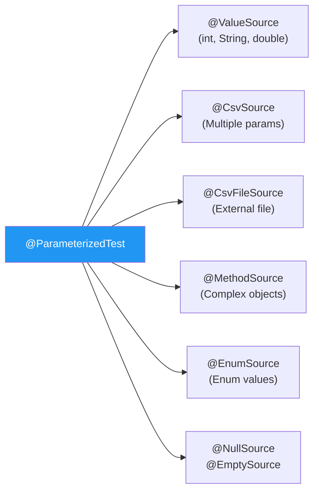
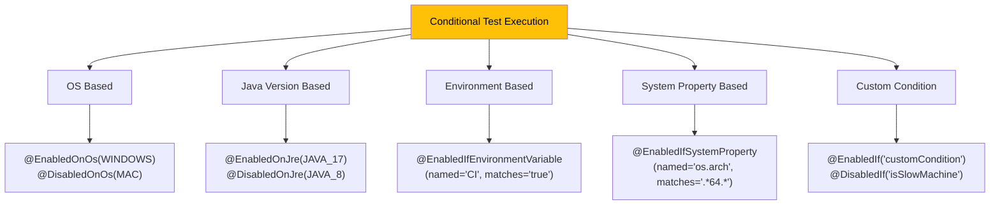
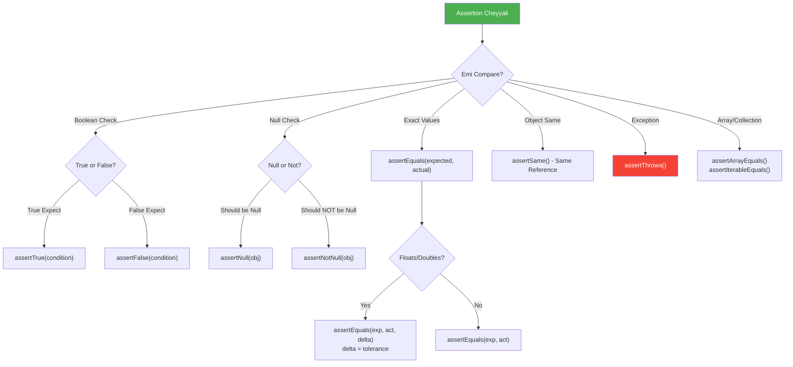

# 🎯 JUnit 5 Visual Guide - Tenglish Edition

> **Gurtu Pettukodaniki Easy Way lo organize chesanu!**

---

## 📋 Quick Decision Flowchart - "Ee Situation lo Edi Use Cheyyali?"

```mermaid
flowchart TD
    START["🧪 Test Raayali"] --> Q1{"Emi Test\nCheyyali?"}
    
    Q1 -->|"Single Value"| BASIC["Basic Assertions\nassertEquals, assertTrue"]
    Q1 -->|"Exception Expect"| EXCEPTION["assertThrows()"]
    Q1 -->|"Multiple Values Same Logic"| PARAM["@ParameterizedTest"]
    Q1 -->|"Related Tests Group"| NESTED["@Nested"]
    Q1 -->|"Same Test Repeat"| REPEAT["@RepeatedTest"]
    
    PARAM --> P1{"Data Ekkadnundi?"}
    P1 -->|"Few Hardcoded"| VS["@ValueSource"]
    P1 -->|"Multiple Args"| CSV["@CsvSource"]
    P1 -->|"External File"| CSF["@CsvFileSource"]
    P1 -->|"Complex Objects"| MS["@MethodSource"]
    P1 -->|"Enum Values"| ES["@EnumSource"]
    
    EXCEPTION --> E1{"Exception Details\nVerify Cheyyala?"}
    E1 -->|"Just Type Check"| AT["assertThrows(Type.class, ...)"]
    E1 -->|"Message Verify"| ATM["assertThrows() + getMessage()"]
    
    BASIC --> B1{"Ekkuva Assertions\nOke Test Lo?"}
    B1 -->|"Independent Assertions"| AA["assertAll()"]
    B1 -->|"Sequential"| SEQ["Normal Assertions"]
    
    style START fill:#4CAF50,color:white
    style PARAM fill:#2196F3,color:white
    style NESTED fill:#9C27B0,color:white
    style EXCEPTION fill:#f44336,color:white
```



---

## 🔄 Test Lifecycle - Execution Order

```mermaid
flowchart TB
    subgraph ONCE["🔵 Class Level (Once Only)"]
        BA["@BeforeAll\n(static method)\nDB Connection, Test Data Setup"]
    end
    
    subgraph EACH["🟢 Per Test Method"]
        BE["@BeforeEach\nFresh Object Creation\nReset State"]
        TEST["@Test\nActual Test Logic"]
        AE["@AfterEach\nCleanup Per Test"]
    end
    
    subgraph FINALLY["🔵 Class Level (Once Only)"]
        AA["@AfterAll\n(static method)\nClose Connections, Final Cleanup"]
    end
    
    BA --> BE
    BE --> TEST
    TEST --> AE
    AE --> |"Next @Test"| BE
    AE --> |"All Tests Done"| AA
    
    style BA fill:#1976D2,color:white
    style AA fill:#1976D2,color:white
    style BE fill:#4CAF50,color:white
    style AE fill:#4CAF50,color:white
    style TEST fill:#FF9800,color:white
```



---

## 📝 Annotations Quick Reference

### 🟢 Core Annotations

| Annotation | Eppudu Use Cheyyali | Example |
|------------|---------------------|---------|
| `@Test` | Every test method ki | `@Test void shouldAddNumbers()` |
| `@DisplayName` | Readable name kavali | `@DisplayName("2+2 should equal 4")` |
| `@Disabled` | Temporarily skip | `@Disabled("Bug #123 pending")` |
| `@BeforeEach` | Every test ki fresh setup | Create new objects |
| `@AfterEach` | Every test tarvata cleanup | Close streams, reset |
| `@BeforeAll` | Once before all tests | DB connection, static data |
| `@AfterAll` | Once after all tests | Close connection |

### 🔵 Parameterized Test Annotations



**Examples:**

```java
// @ValueSource - Single value, multiple runs
@ParameterizedTest
@ValueSource(ints = {1, 2, 3, 4, 5})
void testPositiveNumbers(int num) {
    assertTrue(num > 0);
}

// @CsvSource - Multiple parameters per run
@ParameterizedTest
@CsvSource({
    "1, 2, 3",      // 1+2=3
    "10, 20, 30",   // 10+20=30
    "-1, 1, 0"      // -1+1=0
})
void testAddition(int a, int b, int expected) {
    assertEquals(expected, a + b);
}

// @MethodSource - Complex objects
@ParameterizedTest
@MethodSource("provideUsers")
void testUserValidation(User user, boolean expected) {
    assertEquals(expected, validator.isValid(user));
}

static Stream<Arguments> provideUsers() {
    return Stream.of(
        Arguments.of(new User("John", "john@test.com"), true),
        Arguments.of(new User("", "invalid"), false)
    );
}
```

### 🟣 Structural Annotations

| Annotation | Purpose | Use Case |
|------------|---------|----------|
| `@Nested` | Group related tests | BDD style: Given/When/Then |
| `@TestMethodOrder` | Control test order | Integration tests sequence |
| `@TestInstance` | Lifecycle control | PER_CLASS for expensive setup |

**@Nested Example:**
```java
class UserServiceTest {
    
    @Nested
    @DisplayName("When user exists")
    class WhenUserExists {
        
        @Nested
        @DisplayName("And is active")
        class AndIsActive {
            @Test void shouldAllowLogin() { }
            @Test void shouldShowDashboard() { }
        }
        
        @Nested
        @DisplayName("And is inactive")
        class AndIsInactive {
            @Test void shouldBlockLogin() { }
        }
    }
}
```

### 🟡 Conditional Annotations



---

## ✅ Assertions Guide

### Decision Chart - Edi Use Cheyyali?



### assertAll() - When to Use?

```java
// ❌ Problem: First failure stops execution
@Test
void testUser_normalWay() {
    assertEquals("John", user.getName());     // Fail aitey
    assertEquals("john@test.com", user.getEmail()); // Idi run avvadu!
    assertTrue(user.isActive());
}

// ✅ Solution: assertAll() - All assertions run
@Test
void testUser_betterWay() {
    assertAll("User properties",
        () -> assertEquals("John", user.getName()),
        () -> assertEquals("john@test.com", user.getEmail()),
        () -> assertTrue(user.isActive())
    );
    // All failures reported together!
}
```

---

## ⏱️ Timeout & Performance

```java
// Method Level
@Test
@Timeout(value = 500, unit = TimeUnit.MILLISECONDS)
void shouldCompleteQuickly() {
    // 500ms cross aithe FAIL
}

// Assertion Level
@Test
void testWithTimeout() {
    assertTimeout(Duration.ofMillis(100), () -> {
        // This code must complete in 100ms
        return computeResult();
    });
    
    // Preemptively kills if timeout
    assertTimeoutPreemptively(Duration.ofMillis(100), () -> {
        slowOperation(); // Killed after 100ms
    });
}
```

---

## 🎯 Quick Memory Tips

```
@Test           → Basic test method
@Disabled       → Skip this test
@DisplayName    → Pretty name

@BeforeAll/@AfterAll → Once per class (static)
@BeforeEach/@AfterEach → Once per test

@ParameterizedTest + @ValueSource → Same logic, different single values
@ParameterizedTest + @CsvSource → Same logic, multiple params
@ParameterizedTest + @MethodSource → Complex objects

@Nested → BDD style grouping
@RepeatedTest → Run same test N times

@Timeout → Fail if too slow
@Tag → Categorize tests ("fast", "slow", "integration")

@EnabledOnOs/@DisabledOnOs → Platform specific
@EnabledOnJre → Java version specific
```

---

## 🚀 Real-World Example

```java
@DisplayName("Calculator Tests")
class CalculatorTest {
    
    private Calculator calc;
    
    @BeforeEach
    void setup() {
        calc = new Calculator();
    }
    
    @Nested
    @DisplayName("Addition Tests")
    class AdditionTests {
        
        @ParameterizedTest
        @CsvSource({"1,2,3", "0,0,0", "-1,1,0"})
        void shouldAddCorrectly(int a, int b, int expected) {
            assertEquals(expected, calc.add(a, b));
        }
    }
    
    @Nested
    @DisplayName("Division Tests")
    class DivisionTests {
        
        @Test
        void shouldDivide() {
            assertEquals(5, calc.divide(10, 2));
        }
        
        @Test
        void shouldThrowForDivideByZero() {
            assertThrows(ArithmeticException.class, 
                () -> calc.divide(10, 0));
        }
    }
}
```
