# 🌱 Spring Boot Testing Visual Guide - Tenglish Edition

> **Annotation Confusion End Avthundi! Edi Use Cheyyalo Clear Ga Chuddham!**

---

## 🎯 Master Decision Flowchart - Test Type Selection

```mermaid
flowchart TD
    START["🧪 Spring Boot\nTest Raayali"] --> Q1{"Emi Test\nCheyyali?"}
    
    Q1 -->|"Controller Only\n(HTTP, JSON)"| WEB["@WebMvcTest\n▸ Controller Layer Only\n▸ Fast, Lightweight"]
    
    Q1 -->|"Repository Only\n(Database)"| DATA["@DataJpaTest\n▸ JPA + DB Only\n▸ H2/Testcontainers"]
    
    Q1 -->|"Full Application\n(End-to-End)"| BOOT["@SpringBootTest\n▸ Complete Context\n▸ All Beans Loaded"]
    
    Q1 -->|"Service + Dependencies\n(Business Logic)"| SERVICE["@SpringBootTest\n+ @MockBean"]
    
    WEB --> W1["MockMvc use\nchestha"]
    DATA --> D1["Real DB or\nH2 Embedded"]
    BOOT --> B1{"Real Server\nStart Cheyyala?"}
    
    B1 -->|"No - MockMvc"| MOCK["webEnvironment = MOCK\n(Default)"]
    B1 -->|"Yes - Real Port"| REAL["webEnvironment = RANDOM_PORT\n+ TestRestTemplate"]
    
    style START fill:#4CAF50,color:white
    style WEB fill:#2196F3,color:white
    style DATA fill:#9C27B0,color:white
    style BOOT fill:#FF9800,color:white
```



---

## 🧩 Test Slice Annotations Comparison

```mermaid
flowchart TB
    subgraph SLICES["🔪 Test Slices (Partial Context)"]
        WEB["@WebMvcTest\n─────────────\n✓ Controllers\n✓ Filters\n✓ MockMvc\n✗ Service, Repo"]
        
        DATA["@DataJpaTest\n─────────────\n✓ Repositories\n✓ EntityManager\n✓ H2 DB (default)\n✗ Controllers, Services"]
        
        REST["@RestClientTest\n─────────────\n✓ REST Clients\n✓ MockRestServiceServer\n✗ Controllers, DB"]
        
        JSON["@JsonTest\n─────────────\n✓ JSON Serialization\n✓ JacksonTester\n✗ Web, DB"]
    end
    
    subgraph FULL["🚀 Full Context"]
        BOOT["@SpringBootTest\n─────────────\n✓ Everything\n✓ All Beans\n✓ Real Configuration\n▸ Slower but Complete"]
    end
    
    style WEB fill:#2196F3,color:white
    style DATA fill:#9C27B0,color:white
    style REST fill:#00BCD4,color:white
    style JSON fill:#4CAF50,color:white
    style BOOT fill:#FF9800,color:white
```



---

## 📊 When to Use What? - Decision Matrix

| Scenario | Annotation | Why? |
|----------|------------|------|
| Controller HTTP response verify | `@WebMvcTest` | Only web layer load avthundi, fast |
| JSON request/response check | `@WebMvcTest` | MockMvc + JSON assertions |
| Repository query testing | `@DataJpaTest` | JPA + DB only, no web |
| Service with mocked dependencies | `@SpringBootTest` + `@MockBean` | Need DI + mocking |
| Full end-to-end flow | `@SpringBootTest(webEnvironment=RANDOM_PORT)` | Real server, real DB |
| REST client testing | `@RestClientTest` | Mock external APIs |

---

## 🔵 @WebMvcTest - Controller Layer Testing

### When to Use?


### Complete Example:

```java
@WebMvcTest(UserController.class)  // ONLY UserController loaded
class UserControllerWebLayerTest {
    
    @Autowired
    private MockMvc mockMvc;  // HTTP simulation
    
    @MockBean
    private UserService userService;  // Mock the dependency!
    
    @Test
    @DisplayName("POST /api/users - Should create user successfully")
    void shouldCreateUser() throws Exception {
        // Given - Mock service behavior
        User mockUser = new User(1L, "John", "john@test.com");
        when(userService.registerUser(anyString(), anyString(), anyString()))
            .thenReturn(mockUser);
        
        // When & Then - Test HTTP layer
        mockMvc.perform(post("/api/users")
                .contentType(MediaType.APPLICATION_JSON)
                .content("""
                    {
                        "name": "John",
                        "email": "john@test.com",
                        "password": "pass123"
                    }
                    """))
            .andExpect(status().isCreated())
            .andExpect(jsonPath("$.id").value(1))
            .andExpect(jsonPath("$.name").value("John"))
            .andExpect(jsonPath("$.email").value("john@test.com"));
        
        // Verify service was called
        verify(userService).registerUser("John", "john@test.com", "pass123");
    }
    
    @Test
    @DisplayName("POST /api/users - Should return 400 for invalid input")
    void shouldReturn400ForInvalidInput() throws Exception {
        mockMvc.perform(post("/api/users")
                .contentType(MediaType.APPLICATION_JSON)
                .content("""
                    {
                        "name": "",
                        "email": "invalid-email"
                    }
                    """))
            .andExpect(status().isBadRequest())
            .andExpect(jsonPath("$.errors").isArray());
    }
}
```

---

## 🟣 @DataJpaTest - Repository Layer Testing

### When to Use?



```mermaid
flowchart LR
    subgraph USE_CASE["✅ Perfect For"]
        U1["Custom Queries Working?"]
        U2["JPQL/Native Queries"]
        U3["Pagination/Sorting"]
        U4["Entity Relationships"]
        U5["Query Performance"]
    end
    
    subgraph INCLUDES["What's Loaded"]
        I1["✓ Repositories"]
        I2["✓ EntityManager"]
        I3["✓ DataSource"]
        I4["✓ H2 (auto)"]
    end
    
    style USE_CASE fill:#9C27B0,color:white
    style INCLUDES fill:#4CAF50,color:white
```

### Example:

```java
@DataJpaTest
@AutoConfigureTestDatabase(replace = Replace.NONE)  // Use real DB, not H2
@Testcontainers
class UserRepositoryTest {
    
    @Container
    static MySQLContainer<?> mysql = new MySQLContainer<>("mysql:8.0");
    
    @DynamicPropertySource
    static void configureProperties(DynamicPropertyRegistry registry) {
        registry.add("spring.datasource.url", mysql::getJdbcUrl);
        registry.add("spring.datasource.username", mysql::getUsername);
        registry.add("spring.datasource.password", mysql::getPassword);
    }
    
    @Autowired
    private UserRepository userRepository;
    
    @Autowired
    private TestEntityManager entityManager;
    
    @Test
    void shouldFindByEmail() {
        // Given
        User user = new User("John", "john@test.com", "password");
        entityManager.persistAndFlush(user);
        
        // When
        Optional<User> found = userRepository.findByEmail("john@test.com");
        
        // Then
        assertTrue(found.isPresent());
        assertEquals("John", found.get().getName());
    }
    
    @Test
    void shouldFindActiveUsers() {
        // Test custom query
        List<User> activeUsers = userRepository.findAllActiveUsers();
        assertFalse(activeUsers.isEmpty());
    }
}
```

---

## 🟠 @SpringBootTest - Full Integration Testing

### Web Environment Options

```mermaid
flowchart TD
    SBT["@SpringBootTest"] --> ENV{"webEnvironment = ?"}
    
    ENV -->|"MOCK (default)"| MOCK["No Real Server\n─────────────\n• Uses MockMvc\n• Faster\n• No real port"]
    
    ENV -->|"RANDOM_PORT"| RANDOM["Real Server\n─────────────\n• Actual HTTP calls\n• Random port\n• Use TestRestTemplate"]
    
    ENV -->|"DEFINED_PORT"| DEFINED["Real Server\n─────────────\n• Uses server.port\n• For specific scenarios"]
    
    ENV -->|"NONE"| NONE["No Web Context\n─────────────\n• Service layer only\n• Fastest for non-web"]
    
    style SBT fill:#FF9800,color:white
    style RANDOM fill:#4CAF50,color:white
```



### Full Integration Test Example:

```java
@SpringBootTest(webEnvironment = SpringBootTest.WebEnvironment.RANDOM_PORT)
@Testcontainers
class UserControllerIntegrationTest {
    
    @Container
    static MySQLContainer<?> mysql = new MySQLContainer<>("mysql:8.0")
        .withDatabaseName("testdb");
    
    @DynamicPropertySource
    static void configureProperties(DynamicPropertyRegistry registry) {
        registry.add("spring.datasource.url", mysql::getJdbcUrl);
        registry.add("spring.datasource.username", mysql::getUsername);
        registry.add("spring.datasource.password", mysql::getPassword);
    }
    
    @Autowired
    private TestRestTemplate restTemplate;  // For real HTTP calls
    
    @Autowired
    private UserRepository userRepository;
    
    @MockBean
    private EmailService emailService;  // Still mock external services!
    
    @BeforeEach
    void cleanup() {
        userRepository.deleteAll();
    }
    
    @Test
    void shouldCreateAndRetrieveUser() {
        // Create user via API
        UserRequest request = new UserRequest("John", "john@test.com", "pass123");
        ResponseEntity<User> createResponse = restTemplate.postForEntity(
            "/api/users", request, User.class);
        
        assertEquals(HttpStatus.CREATED, createResponse.getStatusCode());
        Long userId = createResponse.getBody().getId();
        
        // Retrieve via API
        ResponseEntity<User> getResponse = restTemplate.getForEntity(
            "/api/users/" + userId, User.class);
        
        assertEquals(HttpStatus.OK, getResponse.getStatusCode());
        assertEquals("John", getResponse.getBody().getName());
        
        // Verify in DB directly
        assertTrue(userRepository.existsById(userId));
    }
}
```

---

## 🔄 @MockBean vs @SpyBean

```mermaid
flowchart TB
    subgraph MOCKBEAN["@MockBean"]
        MB1["Complete Replacement\n─────────────\n• Original bean replaced\n• All methods return defaults\n• Must stub everything"]
    end
    
    subgraph SPYBEAN["@SpyBean"]
        SB1["Partial Override\n─────────────\n• Wraps real bean\n• Real methods run by default\n• Override specific methods"]
    end
    
    MOCKBEAN --> MBE["when(emailService.send(any()))\n  .thenReturn(true);\n// Must stub all used methods"]
    
    SPYBEAN --> SBE["// Real methods work\n// Only stub what you need:\ndoReturn(false)\n  .when(rateLimiter).isAllowed();"]
    
    style MOCKBEAN fill:#2196F3,color:white
    style SPYBEAN fill:#FF9800,color:white
```



### When to Use Which?

| Use @MockBean | Use @SpyBean |
|---------------|--------------|
| External services (Email, SMS) | Complex services with mostly working code |
| Services you don't control | When you need 90% real, 10% fake |
| When you need complete control | Rate limiters, Feature flags |
| Faster tests (no real code runs) | When stubbing everything is tedious |

---

## 🐳 Testcontainers Integration

### Setup Pattern:


### Base Test Class Pattern (Reusable):

```java
@SpringBootTest(webEnvironment = SpringBootTest.WebEnvironment.RANDOM_PORT)
@Testcontainers
public abstract class AbstractIntegrationTest {
    
    @Container
    protected static MySQLContainer<?> mysql = new MySQLContainer<>("mysql:8.0")
        .withDatabaseName("testdb")
        .withUsername("test")
        .withPassword("test");
    
    @DynamicPropertySource
    static void configureDatabase(DynamicPropertyRegistry registry) {
        registry.add("spring.datasource.url", mysql::getJdbcUrl);
        registry.add("spring.datasource.username", mysql::getUsername);
        registry.add("spring.datasource.password", mysql::getPassword);
        registry.add("spring.jpa.hibernate.ddl-auto", () -> "create-drop");
    }
}

// Extend in your tests
class UserServiceIntegrationTest extends AbstractIntegrationTest {
    @Autowired private UserService userService;
    
    @Test
    void shouldSaveToRealDatabase() {
        User user = userService.register("Test", "test@email.com", "pass123");
        assertNotNull(user.getId());
    }
}
```

---

## 📋 Annotations Quick Reference

### Test Slice Annotations

| Annotation | Loads | Use For |
|------------|-------|---------|
| `@WebMvcTest` | Controllers, MockMvc | Controller layer |
| `@DataJpaTest` | Repositories, JPA | Database queries |
| `@RestClientTest` | REST clients | External API calls |
| `@JsonTest` | JSON mappers | Serialization |
| `@WebFluxTest` | Reactive controllers | WebFlux apps |

### Supporting Annotations

| Annotation | Purpose |
|------------|---------|
| `@MockBean` | Replace bean with mock |
| `@SpyBean` | Wrap real bean with spy |
| `@AutoConfigureMockMvc` | Enable MockMvc in @SpringBootTest |
| `@Testcontainers` | Enable Testcontainers |
| `@Container` | Declare container instance |
| `@DynamicPropertySource` | Dynamic config from containers |
| `@Sql` | Execute SQL before test |
| `@Transactional` | Rollback after each test |

---

## 🎯 Quick Memory Framework

```
TEST TYPE SELECTION:
━━━━━━━━━━━━━━━━━━━━━━━━━━━━━━━━━━━━━━━━
Controller only?     → @WebMvcTest
Repository only?     → @DataJpaTest  
Full integration?    → @SpringBootTest + Testcontainers
Service with mocks?  → @SpringBootTest + @MockBean

WHEN USING @SpringBootTest:
━━━━━━━━━━━━━━━━━━━━━━━━━━━━━━━━━━━━━━━━
MockMvc needed?      → webEnvironment = MOCK (default)
Real HTTP calls?     → webEnvironment = RANDOM_PORT
No web at all?       → webEnvironment = NONE

DATABASE IN TESTS:
━━━━━━━━━━━━━━━━━━━━━━━━━━━━━━━━━━━━━━━━
Quick unit test?     → H2 in-memory
Real integration?    → Testcontainers (MySQL/Postgres)
Production-like?     → Same DB as production

EXTERNAL SERVICES:
━━━━━━━━━━━━━━━━━━━━━━━━━━━━━━━━━━━━━━━━
Always mock!         → @MockBean for EmailService, PaymentGateway, etc.
```

---

## 🚀 Complete Test Class Templates

### Template 1: Controller Unit Test

```java
@WebMvcTest(ProductController.class)
class ProductControllerTest {
    
    @Autowired MockMvc mockMvc;
    @MockBean ProductService productService;
    
    @Test
    void shouldGetProduct() throws Exception {
        when(productService.findById(1L))
            .thenReturn(Optional.of(new Product(1L, "Laptop", 999.99)));
        
        mockMvc.perform(get("/api/products/1"))
            .andExpect(status().isOk())
            .andExpect(jsonPath("$.name").value("Laptop"));
    }
}
```

### Template 2: Full Integration Test

```java
@SpringBootTest(webEnvironment = RANDOM_PORT)
@Testcontainers
class ProductIntegrationTest extends AbstractIntegrationTest {
    
    @Autowired TestRestTemplate restTemplate;
    @Autowired ProductRepository productRepository;
    @MockBean PaymentService paymentService;  // Still mock external!
    
    @Test
    void shouldCreateAndGetProduct() {
        // Create
        var request = new ProductRequest("Laptop", 999.99);
        var response = restTemplate.postForEntity("/api/products", request, Product.class);
        assertEquals(CREATED, response.getStatusCode());
        
        // Verify in DB
        assertTrue(productRepository.existsById(response.getBody().getId()));
    }
}
```
